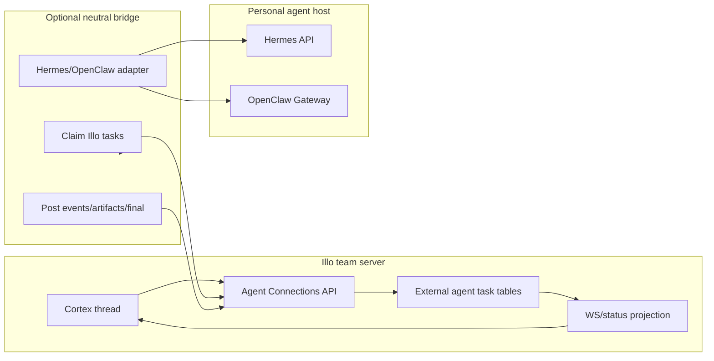

# Personal Agent Connections MVP

Status: planning draft
Date: 2026-05-14
Scope: Illo team-agent connectivity with remote personal autonomous agents, specifically Hermes and OpenClaw.

## Goal

Build an MVP that lets Illo communicate with a user's personal autonomous agent even when that agent is running on another machine.

The MVP must prove both directions:

1. Illo can delegate work from a Cortex thread to Hermes and OpenClaw, track progress, and bring the final answer or artifact back into Illo.
2. Hermes and OpenClaw can share work back into Illo by creating a Cortex thread intended for a teammate or team.

Codex CLI is intentionally out of scope for this MVP because its lifecycle is session/job-oriented, not always-on personal-agent oriented.

## Research Summary

### Protocol posture

The implementation should be "A2A-shaped" internally, without requiring full external A2A compliance on day one.

Useful current protocol facts:

- [A2A](https://a2a-protocol.org/latest/topics/what-is-a2a/) is the best semantic model for agent-to-agent work. It focuses on remote autonomous agents, agent discovery, task lifecycle, streaming/status updates, artifacts, and opaque execution.
- [A2A Agent Cards](https://a2a-protocol.org/latest/topics/agent-discovery/) map cleanly to connection records: identity, service URL, capabilities, auth scheme, and skills.
- [A2A vs MCP](https://a2a-protocol.org/latest/topics/a2a-and-mcp/) is the key boundary: A2A is for agent collaboration and task lifecycle; MCP is for tools/resources.
- [MCP](https://modelcontextprotocol.io/specification/2025-06-18) remains useful later for exposing Illo resources and tools to personal agents, but it should not be the core task transport for this MVP.
- [ACP](https://agentcommunicationprotocol.dev/core-concepts/agent-run-lifecycle) has a useful run lifecycle model, but current ecosystem gravity is moving toward A2A-style semantics.
- [AGNTCY](https://docs.agntcy.org/) and related directory/identity work are interesting future layers, but too heavy for this MVP.

Decision: model Illo's internal external-agent contract around these A2A concepts:

- Agent Card
- Task
- Message
- Part
- Artifact
- Task status updates
- Artifact updates
- Push/poll/stream delivery
- Idempotency keys

Do not block on shipping a public A2A endpoint until we have Hermes/OpenClaw working.

### Hermes surface

Hermes already exposes a programmatic API server. The docs describe it as an [OpenAI-compatible HTTP endpoint](https://hermes-agent.nousresearch.com/docs/user-guide/features/api-server/) with full agent tool access and streaming progress.

Important Hermes integration path:

- Direct HTTPS/HTTP API adapter.
- Prefer Hermes run-oriented endpoints when available because they map better to Illo task state.
- Fall back to OpenAI-compatible chat/responses style only when a configured Hermes install does not expose run lifecycle endpoints.
- Use Hermes webhooks later for push completion if stable in the target install.

MVP implication: Hermes is the easiest direct adapter candidate.

### OpenClaw surface

OpenClaw is built around a Gateway that can be remote. Its [Gateway WebSocket protocol](https://docs.openclaw.ai/gateway/protocol) is the primary control plane. It also exposes HTTP APIs that are useful for an MVP:

- [OpenResponses API](https://docs.openclaw.ai/gateway/openresponses-http-api), including `POST /v1/responses`, agent selection through `model: "openclaw/<agentId>"` or `x-openclaw-agent-id`, and streaming.
- [Tools Invoke API](https://docs.openclaw.ai/gateway/tools-invoke-http-api), including session tools like `sessions_send`, though some powerful tools are denied by default for safety.
- [Remote access guidance](https://docs.openclaw.ai/gateway/remote) assumes the Gateway may live on a persistent host and clients connect via SSH, tailnet, or remote URL.
- [Tailscale guidance](https://docs.openclaw.ai/gateway/tailscale) reinforces that safe remote deployments should usually keep the Gateway loopback-bound and expose it through a private network or authenticated tunnel.

MVP implication: OpenClaw can work either directly through `/v1/responses` or through a neutral bridge that connects to the user's Gateway locally/remotely. The bridge-first path is safer because it handles private/tailnet/loopback setups without forcing Illo to reach into a user's private network.

## Codebase Review

### Existing Illo primitives we should reuse

Illo already has most of the local collaboration machinery:

- FastAPI app assembly in `brain/app/api/main.py`.
- Session and service-principal auth in `brain/app/api/auth.py`.
- Permission helpers in `brain/app/api/authorization.py`.
- Product-native trigger normalization in `brain/app/triggers/contracts.py`.
- Trigger routing to AgentRuns in `brain/app/triggers/router.py`.
- Cortex idea/thread persistence in `brain/platform/db/models/idea.py`.
- Native chat persistence in `brain/platform/db/models/chat.py`.
- AgentRun queue/events/artifacts in `brain/platform/db/models/agent_run.py` and `brain/systems/runs/store.py`.
- Cortex websocket fanout and durable replay in `brain/systems/cortex/events.py` and `brain/app/api/routers/ws.py`.
- Team chat service and agent-authored replies in `brain/app/api/services/chat.py`.
- Workspace notifications and mentions in `brain/app/api/routers/cortex/_idea_ops.py`.
- Vault secrets and task-scoped agent grants in `brain/platform/db/models/vault.py`.
- Workspace app HTTP connector infrastructure in `brain/systems/workspace_apps/generic_http.py`.
- MCP server in `brain/app/mcp/server.py` for local tool/resource access.

These give us a strong base: durable state, org scoping, thread UX, notification plumbing, websockets, and an existing agent runtime.

### Important current constraints

The current internal run system is not the right persistence layer for personal-agent tasks.

AgentRuns are Illo-owned work:

- An AgentRun has an Illo worker lifecycle: queued, claimed, started, completed, failed, canceled.
- It assumes Illo runtime ownership of the execution.
- Its events/artifacts are good local projections, but not enough to represent remote task ownership, remote IDs, remote session IDs, external connection health, or provider-specific state.

External personal-agent tasks should be first-class rows, not overloaded AgentRuns.

The existing `ILLO_API_TOKEN` service principal is too broad for this work:

- `brain/app/api/config.py` supports `ILLO_API_TOKEN`.
- `brain/app/api/auth.py` maps that token to `internal-api`.
- `brain/app/api/authorization.py` grants broad internal permissions to service principals.

Personal agents and bridges need scoped connection tokens, not full internal service-principal access.

The existing MCP server should not be exposed as the remote integration surface:

- `brain/app/mcp/server.py` is stdio by default.
- Its HTTP mode binds to `127.0.0.1` and is positioned for testing/debugging.
- It has powerful access to memory/vault functionality.

MCP can become a local tool/resource layer for bridge processes later, but not the initial remote auth boundary.

Workspace app `generic.http` is useful but insufficient as the core:

- It executes bounded HTTP requests and maps responses.
- It does not model long-running work, remote task IDs, progress, cancellation, artifacts, retries, or inbound personal-agent sharing.

### Gaps to fill

The MVP needs these new capabilities:

- External agent connection records.
- Scoped connection tokens.
- External task lifecycle.
- External task event log.
- External task artifact model.
- Adapter layer for Hermes/OpenClaw/bridge.
- Illo-to-agent delegation endpoint.
- Agent-to-Illo tool surface for workspace reads, headless Illo context asks, and public thread sharing.
- Websocket/status projection into Cortex.
- Minimal UI/API for creating and testing connections.
- Bridge process that can run next to Hermes/OpenClaw when direct inbound/outbound networking is hard.

## Product Stories

### Story 1: Illo delegates to a personal agent

As a teammate inside Illo, I can open a Cortex idea/thread and delegate work to my personal Hermes or OpenClaw agent.

Expected MVP behavior:

- User chooses a connected personal agent.
- Illo creates an external task linked to the idea/thread.
- Illo posts a visible "delegated" status into the thread or stream.
- A bridge or adapter sends the task to Hermes/OpenClaw.
- Progress events appear in Illo.
- The final answer is posted back as a thread message.
- Artifacts are attached or linked.
- Failures are visible and retryable.

### Story 2: Personal agent asks and shares into Illo

As a user inside Hermes/OpenClaw, I can ask my personal agent to inspect Illo workspace context, ask Illo a headless context question, or share work publicly with a teammate in Illo.

Expected MVP behavior:

- Personal agent calls scoped Illo bridge APIs, never raw DB endpoints and never the broad internal service token.
- For structured reads, Illo returns bounded workspace facts: threads, team members, recent activity, project context, and relevant workspace records.
- For deeper context, `illo_ask_illo` runs Illo headlessly and returns a private answer to the personal agent.
- For public collaboration, `illo_create_thread` creates a Cortex idea/thread with title, body, owner, artifacts, and optional teammate mentions.
- Mentioned teammates receive normal Illo notifications.
- A public created thread can trigger Illo visibly only when the personal agent explicitly asks for it.

## Architecture Recommendation

Use a bridge-first architecture with direct adapters as optimizations.



Why bridge-first:

- Assumes Hermes/OpenClaw are not on the same machine as Illo.
- Avoids requiring Illo to reach private `127.0.0.1`, LAN, or tailnet addresses directly.
- Lets the user run the bridge wherever the personal agent can be reached.
- Works for Hermes, OpenClaw, and future personal agents with the same Illo contract.
- Gives us reliable polling/heartbeat even when webhooks are unavailable.
- Lets direct adapters be added without changing Illo's product model.

Direct adapters are still useful:

- Hermes direct adapter should be supported early because Hermes has a clearer HTTP API.
- OpenClaw direct `/v1/responses` adapter can be supported where the Gateway is reachable from Illo.
- OpenClaw Gateway WS integration can come after the first proof if we need richer session/cancel/event control.

## Data Model

Add a new SQLAlchemy model module, for example:

- `brain/platform/db/models/external_agent.py`

Register it in:

- `brain/platform/db/models/__init__.py`

Add repositories as needed under:

- `brain/platform/db/repositories/external_agents.py`

Add UnitOfWork accessors in:

- `brain/platform/db/repositories/unit_of_work.py`

### `external_agent_connections`

Purpose: one connected personal agent identity/configuration.

Recommended fields:

- `id UUID primary key`
- `org_id UUID not null`
- `owner_user_id UUID not null`
- `display_name text not null`
- `agent_kind text not null`
  - `hermes`
  - `openclaw`
  - `generic`
- `transport text not null`
  - `bridge_polling`
  - `hermes_runs`
  - `hermes_openai_compatible`
  - `openclaw_responses`
  - `openclaw_gateway_ws`
  - `openclaw_hooks`
- `status text not null`
  - `pending`
  - `connected`
  - `degraded`
  - `offline`
  - `disabled`
- `endpoint_url text null`
- `remote_agent_id text null`
- `remote_session_key text null`
- `remote_agent_card jsonb not null default {}`
- `capabilities jsonb not null default {}`
- `auth_secret_ref text null`
- `auth_metadata jsonb not null default {}`
- `last_seen_at timestamptz null`
- `last_tested_at timestamptz null`
- `last_error text null`
- `metadata jsonb not null default {}`
- `created_at timestamptz not null default now()`
- `updated_at timestamptz not null default now()`
- `disabled_at timestamptz null`

Indexes:

- `(org_id, owner_user_id, status)`
- `(org_id, agent_kind)`
- `(status, last_seen_at)`

Notes:

- For MVP, `auth_secret_ref` can point to a Vault key or encrypted config owned by the connection owner.
- Do not store plaintext remote agent tokens in this table.
- Store the A2A-shaped Agent Card snapshot in `remote_agent_card`.

### `external_agent_connection_tokens`

Purpose: scoped Illo API token for bridge/personal-agent callbacks.

Recommended fields:

- `id UUID primary key`
- `connection_id UUID not null`
- `org_id UUID not null`
- `owner_user_id UUID not null`
- `token_hash text not null unique`
- `token_prefix text not null`
- `name text not null`
- `scopes jsonb not null default []`
- `created_at timestamptz not null default now()`
- `last_used_at timestamptz null`
- `expires_at timestamptz null`
- `revoked_at timestamptz null`

Initial scopes:

- `connection:heartbeat`
- `task:claim`
- `task:update`
- `task:complete`
- `artifact:write`
- `illo:thread:create`
- `illo:thread:write`

Token format:

- Return the raw token once when generated.
- Store only a SHA-256 or stronger hash.
- Keep a short display prefix for UI/debugging.

### `external_agent_tasks`

Purpose: one delegation/share unit with remote ownership.

Recommended fields:

- `id UUID primary key`
- `org_id UUID not null`
- `connection_id UUID not null`
- `created_by_user_id UUID null`
- `source_surface text not null`
  - `cortex`
  - `chat`
  - `api`
  - `bridge_share`
- `source_idea_id UUID null`
- `source_thread_message_id integer null`
- `source_chat_conversation_id UUID null`
- `source_chat_message_id integer null`
- `title text not null`
- `instructions text not null`
- `input_parts jsonb not null default []`
- `status text not null`
  - `queued`
  - `claimed`
  - `submitted`
  - `running`
  - `input_required`
  - `completed`
  - `failed`
  - `cancelled`
  - `expired`
- `remote_task_id text null`
- `remote_run_id text null`
- `remote_session_id text null`
- `idempotency_key text not null`
- `deadline_at timestamptz null`
- `claimed_at timestamptz null`
- `submitted_at timestamptz null`
- `started_at timestamptz null`
- `completed_at timestamptz null`
- `failed_at timestamptz null`
- `cancelled_at timestamptz null`
- `result_summary text null`
- `error text null`
- `metadata jsonb not null default {}`
- `created_at timestamptz not null default now()`
- `updated_at timestamptz not null default now()`

Indexes/constraints:

- unique `(connection_id, idempotency_key)`
- `(org_id, status, created_at)`
- `(connection_id, status, created_at)`
- `(source_idea_id, created_at)`
- `(remote_task_id)`

### `external_agent_task_events`

Purpose: durable, replayable event log for progress/status.

Recommended fields:

- `id bigserial primary key`
- `task_id UUID not null`
- `org_id UUID not null`
- `connection_id UUID not null`
- `sequence_no integer not null`
- `event_type text not null`
- `status text null`
- `message text null`
- `payload jsonb not null default {}`
- `remote_event_id text null`
- `producer text not null`
  - `illo`
  - `bridge`
  - `hermes`
  - `openclaw`
- `visibility text not null default 'public'`
- `created_at timestamptz not null default now()`

Constraints:

- unique `(task_id, sequence_no)`

Common event types:

- `external_task.created`
- `external_task.claimed`
- `external_task.submitted`
- `external_task.running`
- `external_task.progress`
- `external_task.artifact_created`
- `external_task.input_required`
- `external_task.completed`
- `external_task.failed`
- `external_task.cancelled`

### `external_agent_task_artifacts`

Purpose: remote output artifacts independent of Illo AgentRun artifacts.

Recommended fields:

- `id UUID primary key`
- `task_id UUID not null`
- `org_id UUID not null`
- `connection_id UUID not null`
- `kind text not null`
  - `text`
  - `markdown`
  - `json`
  - `file`
  - `url`
  - `image`
- `title text null`
- `mime_type text null`
- `content_text text null`
- `content_json jsonb null`
- `uri text null`
- `upload_id text null`
- `metadata jsonb not null default {}`
- `created_at timestamptz not null default now()`

MVP artifact rule:

- Accept markdown/text/json/url immediately.
- Defer binary file upload unless a specific Hermes/OpenClaw test needs it.
- Reuse existing Cortex thread `attachments` shape when posting final messages.

## Backend Modules

### Contracts

Add:

- `brain/systems/external_agents/contracts.py`

Key objects:

- `ExternalAgentCard`
- `ExternalAgentConnection`
- `ExternalAgentTask`
- `ExternalAgentMessage`
- `ExternalAgentPart`
- `ExternalAgentArtifact`
- `ExternalAgentTaskEvent`
- `ExternalAgentStatus`

Keep the contract A2A-shaped:

```python
class ExternalAgentPart(BaseModel):
    kind: Literal["text", "json", "file", "url"]
    text: str | None = None
    data: dict[str, Any] | None = None
    uri: str | None = None
    mime_type: str | None = None
```

### Service

Add:

- `brain/systems/external_agents/service.py`

Responsibilities:

- Create/list/update connections.
- Generate/revoke scoped connection tokens.
- Authenticate bridge tokens.
- Create external tasks from Cortex/chat/API.
- Claim queued tasks for bridge connections.
- Submit task status transitions.
- Append events and artifacts.
- Complete/fail/cancel tasks.
- Mirror important state into Cortex thread/UI.
- Resolve teammate mentions for inbound shares.

Service invariants:

- A token can only act on its own `connection_id`.
- A token can only act in its own `org_id`.
- Terminal tasks cannot be mutated except for idempotent duplicate event/artifact writes.
- Event sequence numbers are monotonic per task.
- Completion must create exactly one visible final projection unless explicitly marked silent.

### Adapters

Add:

- `brain/systems/external_agents/adapters/base.py`
- `brain/systems/external_agents/adapters/hermes.py`
- `brain/systems/external_agents/adapters/openclaw.py`
- `brain/systems/external_agents/adapters/bridge.py`

Base adapter shape:

```python
class ExternalAgentAdapter(Protocol):
    async def submit_task(self, task: ExternalAgentTask) -> AdapterSubmitResult: ...
    async def poll_task(self, task: ExternalAgentTask) -> AdapterPollResult: ...
    async def cancel_task(self, task: ExternalAgentTask) -> AdapterCancelResult: ...
    async def test_connection(self, connection: ExternalAgentConnection) -> AdapterTestResult: ...
```

Hermes adapter:

- Use configured base URL and bearer token.
- Prefer run lifecycle endpoints.
- Store Hermes `run_id` in `remote_run_id`.
- Poll or stream events.
- Map Hermes final response to `external_agent_task_artifacts`.

OpenClaw Responses adapter:

- Use `POST /v1/responses`.
- Send bearer token.
- Select agent through `model: "openclaw/<agentId>"` or `x-openclaw-agent-id`.
- Use `stream=true` when stable.
- Store returned response/session IDs if available.
- For first MVP, completion may be synchronous/streaming rather than long-running polling.

OpenClaw Gateway WS adapter:

- Defer unless `/v1/responses` is insufficient.
- Later target `sessions.send`, `agent.wait`, `sessions.abort`, and session event subscriptions.

Bridge adapter:

- Does not call Hermes/OpenClaw from Illo.
- Creates queued tasks and waits for a bridge process to claim them.
- Best default for remote/private personal agents.

## API Plan

### Human/admin connection APIs

Add router:

- `brain/app/api/routers/agent_connections.py`

Mount in `brain/app/api/main.py`.

Endpoints:

- `GET /api/agent-connections`
- `POST /api/agent-connections`
- `GET /api/agent-connections/{connection_id}`
- `PATCH /api/agent-connections/{connection_id}`
- `POST /api/agent-connections/{connection_id}/token`
- `POST /api/agent-connections/{connection_id}/test`
- `POST /api/agent-connections/{connection_id}/disable`

Permissions:

- Owner/admin can manage org-level connections.
- Members can manage their own personal connections if product policy allows.
- MVP can start with owner/admin plus owner_user self-management.

Schemas:

- `brain/app/api/schemas/agent_connections.py`

### Illo-to-personal-agent task APIs

Add:

- `POST /api/cortex/ideas/{idea_id}/external-agent-tasks`
- `GET /api/cortex/ideas/{idea_id}/external-agent-tasks`
- `POST /api/external-agent-tasks/{task_id}/cancel`

Request:

```json
{
  "connection_id": "uuid",
  "instructions": "Please investigate this and report back.",
  "include_thread_context": true,
  "include_project_context": true,
  "metadata": {}
}
```

Response:

```json
{
  "id": "uuid",
  "status": "queued",
  "connection_id": "uuid",
  "source_idea_id": "uuid"
}
```

Creation behavior:

- Verify caller can access the idea.
- Capture relevant thread/project context.
- Create `external_agent_tasks`.
- Append `external_task.created`.
- Insert a visible Cortex thread message or stream item:
  - role: `illo`
  - message_type: `external_agent_status`
  - metadata: `{ "external_agent_task_id": "...", "connection_id": "..." }`
- Broadcast `external_agent_task_event`.

### Bridge APIs

Add router:

- `brain/app/api/routers/agent_bridge.py`

Use a custom auth dependency, not `get_current_user`, because these calls should use scoped connection tokens only.

Endpoints:

- `POST /api/agent-bridge/heartbeat`
- `POST /api/agent-bridge/tasks/claim`
- `POST /api/agent-bridge/tasks/{task_id}/events`
- `POST /api/agent-bridge/tasks/{task_id}/artifacts`
- `POST /api/agent-bridge/tasks/{task_id}/complete`
- `POST /api/agent-bridge/tasks/{task_id}/fail`
- `POST /api/agent-bridge/tasks/{task_id}/cancelled`
- `POST /api/agent-bridge/share/thread`
- `POST /api/agent-bridge/threads/{idea_id}/messages`
- `GET /api/agent-bridge/threads/{idea_id}`
- `POST /api/agent-bridge/workspace/search`
- `GET /api/agent-bridge/team/members`
- `POST /api/agent-bridge/artifacts`
- `POST /api/agent-bridge/illo/ask`
- `GET /api/agent-bridge/illo/asks/{ask_id}`

Bridge auth:

- `Authorization: Bearer illo_conn_...`
- Hash token.
- Load token row.
- Reject if revoked/expired.
- Confirm required scope.
- Set last used timestamp.
- Return a connection-scoped identity object internally.

`tasks/claim` request:

```json
{
  "max_tasks": 1,
  "agent_kind": "openclaw",
  "capabilities": ["text", "artifacts"]
}
```

`tasks/claim` response:

```json
{
  "tasks": [
    {
      "id": "uuid",
      "title": "Investigate ...",
      "instructions": "...",
      "input_parts": [],
      "metadata": {},
      "source": {
        "surface": "cortex",
        "idea_id": "uuid",
        "thread_message_id": 123
      }
    }
  ]
}
```

`share/thread` request:

```json
{
  "title": "Work to share",
  "body": "Summary in markdown",
  "teammate_mentions": ["Reda"],
  "trigger_illo": false,
  "artifacts": [],
  "metadata": {
    "remote_session_id": "...",
    "remote_task_id": "..."
  }
}
```

Share behavior:

- Create an `Idea` with `origin="external_agent_share"`.
- Add a first `IdeaThread` message.
- Resolve teammate mentions using the same mention logic as Cortex thread messages.
- Create workspace notifications.
- Broadcast `idea_created`, `thread_message`, and notification summary updates.
- By default, do not auto-trigger Illo. Sharing a summary should not accidentally spawn public Illo work.
- If `trigger_illo` is true, or if the body explicitly invokes Illo, route through the existing Cortex `/notify` path or trigger service so Illo runs publicly in that thread.

### Personal-agent Illo tool surface

The bridge API should expose a small, scoped tool surface to Hermes/OpenClaw. This is the MVP shape for Personal agent -> Illo collaboration.

Initial tools:

- `illo_submit_signal`: default path for routine progress and automatic hook updates; submits an inbound signal so IloSpace can decide what to do.
- `illo_search_workspace`: bounded structured search/read over Illo workspace context.
- `illo_get_thread`: read a known Cortex idea/thread.
- `illo_get_team_members`: resolve teammate names and IDs for mentions.
- `illo_ask_illo`: ask Illo a headless/private context question.
- `illo_create_thread`: advanced compatibility tool for an explicitly requested public Cortex idea/thread.
- `illo_post_thread_message`: advanced compatibility tool for an explicitly targeted existing Cortex thread.
- `illo_upload_artifact`: attach or link output artifacts.

`illo_search_workspace` should not expose raw database access. It should return normalized facts from approved sources such as:

- Cortex ideas and thread messages.
- Team members.
- Recent team/workspace activity.
- Project Context profiles and attachments.
- Workspace app/domain records that are safe for the connection scope.
- AgentRun summaries and final artifacts when visible to the connection owner.

`illo_ask_illo` is headless only. It does not create a Cortex idea/thread and it does not post public messages. It exists for questions like:

```json
{
  "prompt": "What does Illo know about the API migration plan?",
  "context": {
    "reason": "Hermes is preparing a teammate handoff.",
    "max_recent_threads": 10
  }
}
```

Implementation detail for `illo_ask_illo`:

- Create an Illo-owned AgentRun with a synthetic `thread_id`, for example `external-agent:{connection_id}:{ask_id}`.
- Store `target_ref.kind = "external_agent_headless_query"` and include `connection_id`, `ask_id`, and remote session metadata.
- Use a read-focused tool policy for the first MVP. Favor workspace/context tools and avoid write tools.
- Return `ask_id`, `run_id`, and status from `POST /api/agent-bridge/illo/ask`.
- Let the personal agent poll `GET /api/agent-bridge/illo/asks/{ask_id}` for final answer/artifacts.
- Do not include the synthetic thread in Cortex `unified-stream`; it is an audit/runtime record, not a public workspace thread.

`illo_submit_signal` is the default public coordination path for routine progress. `illo_create_thread` is reserved for explicit user-directed publishing. If the personal agent wants Illo to collaborate visibly in a newly created thread, it should create a thread and set `trigger_illo: true` or write an explicit Illo invocation in the body.

## Bridge Process

Create a small neutral bridge as part of the MVP. Recommended location:

- `tools/personal-agent-bridge/`

Implementation language:

- Python is fine because the backend is Python and tests can share fixtures.
- TypeScript is also fine if we want an npm-installable package later.

MVP config:

```env
ILLO_BASE_URL=https://illo.example.com
ILLO_AGENT_CONNECTION_TOKEN=illo_conn_...
PERSONAL_AGENT_KIND=openclaw
PERSONAL_AGENT_TRANSPORT=openclaw_responses
OPENCLAW_BASE_URL=http://127.0.0.1:18789
OPENCLAW_TOKEN=...
OPENCLAW_AGENT_ID=main
HERMES_BASE_URL=http://127.0.0.1:8642
HERMES_TOKEN=...
```

Bridge loop:

1. Heartbeat to Illo every 30 seconds.
2. Claim one or more tasks.
3. Submit each task to the configured personal agent.
4. Stream/poll progress where supported.
5. Post progress events to Illo.
6. Post artifacts as they are produced.
7. Complete or fail the Illo task.

Bridge commands:

- `bridge doctor`
- `bridge run`
- `bridge once`
- `bridge test-hermes`
- `bridge test-openclaw`

The bridge should include a tool manifest/prompt snippet for Hermes/OpenClaw:

- `illo_search_workspace`
- `illo_get_thread`
- `illo_get_team_members`
- `illo_ask_illo`
- `illo_create_thread`
- `illo_post_thread_message`
- `illo_upload_artifact`
- `illo_complete_task`
- `illo_fail_task`

For MVP, these can be direct REST calls documented for the user rather than native MCP tools inside Hermes/OpenClaw.

## UI Plan

Keep UI minimal for the first proof.

### Connection management

Potential locations:

- Add a compact "Personal Agents" section on the Team page.
- Or create a small System sub-section once the backend works.

MVP UI elements:

- Connection list.
- Status: connected/offline/disabled.
- Agent kind: Hermes/OpenClaw.
- Transport: bridge/direct.
- Last seen.
- Generate token button.
- Test connection button.
- Copy bridge config snippet.

### Cortex delegation

MVP options:

1. API-only first, then UI.
2. Add a small "Delegate" action in the Cortex thread/composer.

Recommended:

- Build API-first.
- Then add a simple delegated task action once Hermes and OpenClaw are both responding.

Thread/status projection:

- Reuse current `thread_message` websocket path for final visible responses.
- Add `external_agent_task_event` websocket events for live progress.
- Extend `frontend/src/lib/types/cortex.ts` only if we introduce a first-class stream item.

MVP can avoid a new stream item by using:

- status thread messages with `message_type="external_agent_status"`;
- final thread messages with `message_type="external_agent_response"`;
- metadata holding task/connection IDs.

That keeps the frontend lift small.

## Status Projection

When an external task changes state, the service should:

1. Persist an external task event.
2. Broadcast `external_agent_task_event` to the org.
3. If the task is tied to an idea, include `idea_id`.
4. On terminal success, create a visible Cortex thread message.
5. On terminal failure, create a visible failure/status thread message.
6. Update idea status conservatively:
   - queued/submitted/running -> `working`
   - input_required -> `needs_input`
   - completed -> `unread_reply`
   - failed -> `failed`

This mirrors the existing `add_thread_message_raw` lifecycle without pretending the external agent is an Illo AgentRun.

## Security Plan

### Non-negotiables for MVP

- Do not give personal agents `ILLO_API_TOKEN`.
- Do not expose the existing MCP HTTP server.
- Do not store plaintext remote Hermes/OpenClaw tokens in new tables.
- Do not let a connection token act outside its connection/org.
- Do not let bridge tokens call general Illo APIs.
- Add rate limiting to bridge endpoints.
- Validate artifact sizes and content types.
- Ensure all external task reads/writes are org-scoped.
- Record audit metadata on thread creation and task completion.
- Keep `illo_ask_illo` headless and read-focused for MVP; it should not grant personal agents arbitrary Illo write tools.
- Return normalized workspace facts from bridge read tools instead of raw SQL rows or unrestricted database access.

### Token design

Use dedicated connection tokens:

- Prefix raw token with `illo_conn_`.
- Store only hash and prefix.
- Token rows carry scopes.
- Token rows are revocable.
- Token rows can expire.
- Auth dependency returns a narrow `AgentConnectionPrincipal`.

### Network design

Direct Illo-to-agent calls should only happen when configured intentionally.

For remote personal agents:

- Prefer bridge polling from the personal-agent environment.
- If using OpenClaw directly, prefer tailnet/VPN or authenticated HTTPS.
- If using Hermes directly, require explicit base URL and bearer token.
- Never assume `localhost` means the user's personal machine from the Illo server.

## Implementation Milestones

### Milestone 0: Confirm the implementation shape

Deliverables:

- This doc reviewed.
- Agreement on bridge-first plus optional direct adapters.
- Agreement on first UI depth.
- Agreement on whether connection management starts on Team or System page.

Exit criteria:

- We are ready to create schema migrations and service scaffolding.

### Milestone 1: Persistence and service core

Deliverables:

- Add `external_agent_connections`.
- Add `external_agent_connection_tokens`.
- Add `external_agent_tasks`.
- Add `external_agent_task_events`.
- Add `external_agent_task_artifacts`.
- Add repository/service layer.
- Add token hashing and scope checks.
- Add state transition helpers.

Tests:

- Token hash/revocation/expiry.
- Task state transitions.
- Idempotent task creation.
- Event sequence monotonicity.
- Org scoping.

Exit criteria:

- A unit test can create a connection, mint a token, create a task, claim it, update events, add an artifact, and complete it.

### Milestone 2: Bridge API

Deliverables:

- Add `agent_bridge.py` router.
- Add scoped auth dependency.
- Implement heartbeat, claim, event, artifact, complete, fail.
- Implement scoped workspace read endpoints.
- Implement headless `illo_ask_illo`.
- Implement public inbound thread share/create/post endpoints.
- Broadcast status events.
- Insert final Cortex thread messages on completion.

Tests:

- Bridge token cannot access normal APIs.
- Wrong token cannot claim another connection's task.
- Revoked token fails.
- Workspace search returns bounded normalized records, not raw DB access.
- `illo_ask_illo` creates a headless/audited run without creating a Cortex idea.
- `share/thread` creates idea/thread and notifications.
- `share/thread` only triggers public Illo work when explicitly requested.
- Completion posts a final thread message exactly once.

Exit criteria:

- A fake bridge can complete a task end-to-end through the API, query Illo context, ask Illo headlessly, and create a public thread.

### Milestone 3: Illo -> external task creation

Deliverables:

- Add Cortex endpoint `POST /api/cortex/ideas/{idea_id}/external-agent-tasks`.
- Build context pack from idea title, latest thread messages, attachments metadata, and project context.
- Create a visible "delegated to personal agent" projection.
- Add cancellation endpoint.

Tests:

- User must have access to idea.
- Created task contains expected context.
- Delegation creates status projection.
- Cancel works before claim and after claim when adapter supports it.

Exit criteria:

- From an Illo thread, we can create a queued external task visible in the stream.

### Milestone 4: Neutral bridge MVP

Deliverables:

- Add bridge CLI under `tools/personal-agent-bridge/`.
- Implement Illo heartbeat/claim/update/complete client.
- Implement fake provider mode.
- Implement Hermes provider mode.
- Implement OpenClaw provider mode through `/v1/responses`.
- Add README/runbook for running the bridge next to Hermes/OpenClaw.

Tests:

- Bridge fake provider integration test.
- Hermes adapter request mapping test.
- OpenClaw adapter request mapping test.
- Retry/backoff on transient Illo failure.

Exit criteria:

- Running `bridge once` against fake provider completes a real Illo task.

### Milestone 5: Hermes live test

Deliverables:

- Configure a Hermes connection.
- Run bridge or direct Hermes adapter.
- Submit a Cortex delegation.
- Receive progress/final.
- Post final answer into Cortex.

Manual confirmation:

- Hermes receives the Illo task.
- Hermes can use its normal toolset.
- Illo shows task progress or at least submitted/running/completed status.
- Illo thread contains the final Hermes response.
- Any returned artifact is represented in Illo.

Exit criteria:

- A real Hermes instance completes a task initiated by Illo.

### Milestone 6: OpenClaw live test

Deliverables:

- Configure an OpenClaw connection.
- Run bridge or direct OpenClaw `/v1/responses` adapter.
- Submit a Cortex delegation.
- Receive final/progress where supported.
- Post final answer into Cortex.

Manual confirmation:

- OpenClaw receives the Illo task through Gateway/Responses/bridge.
- The chosen OpenClaw agent/session handles the work.
- Illo shows task progress or at least submitted/running/completed status.
- Illo thread contains the final OpenClaw response.
- Any returned artifact is represented in Illo.

Exit criteria:

- A real OpenClaw instance completes a task initiated by Illo.

### Milestone 7: Personal agent -> Illo tool surface

Deliverables:

- Bridge read/share/ask APIs stabilized.
- Hermes/OpenClaw bridge instructions include `illo_submit_signal`, `illo_search_workspace`, `illo_get_thread`, `illo_ask_illo`, `illo_create_thread`, and `illo_post_thread_message`.
- `illo_ask_illo` runs headlessly and returns a private Illo answer to the personal agent.
- `illo_create_thread` creates Cortex idea/thread.
- Mentions/notifications work.
- Public Illo triggering works only when explicitly requested.

Manual confirmation:

- From a Hermes session, ask Hermes to query Illo workspace context.
- From a Hermes session, ask Hermes to use headless `illo_ask_illo` for a private context answer.
- From a Hermes session, ask Hermes to share work with a teammate in Illo.
- A new Illo Cortex thread is created.
- The teammate can see or is notified about it.
- Repeat from OpenClaw.

Exit criteria:

- Both Hermes and OpenClaw can query Illo context, ask Illo headlessly, and initiate a public share into Illo.

### Final Milestone: End-to-end MVP confirmation

The MVP is confirmed only when all three live checks pass:

1. Illo -> Hermes:
   - Create a Cortex task in Illo.
   - Delegate to Hermes.
   - Hermes completes it.
   - Illo receives and displays the final answer/artifact.

2. Illo -> OpenClaw:
   - Create a Cortex task in Illo.
   - Delegate to OpenClaw.
   - OpenClaw completes it.
   - Illo receives and displays the final answer/artifact.

3. Hermes/OpenClaw -> Illo:
   - From a Hermes session, ask Illo a headless context question and receive the private result.
   - From an OpenClaw session, ask Illo a headless context question and receive the private result.
   - From a Hermes session, create/share an Illo Cortex thread for a teammate.
   - From an OpenClaw session, create/share an Illo Cortex thread for a teammate.
   - The created thread is visible in Illo with correct content, metadata, and notifications.
   - Public Illo work is triggered from `illo_create_thread` only when explicitly requested.

## Test Plan

### Unit tests

Add tests under `tests/`:

- `test_external_agent_connections.py`
- `test_external_agent_bridge_auth.py`
- `test_external_agent_tasks.py`
- `test_external_agent_workspace_tools.py`
- `test_external_agent_share.py`
- `test_external_agent_ask_illo.py`
- `test_external_agent_adapters.py`

Coverage:

- Token generation, hashing, prefix display, revocation.
- Scope enforcement.
- Connection CRUD and ownership.
- Task creation and idempotency.
- Task claiming.
- State transitions.
- Event sequencing.
- Artifact validation.
- Completion projection into Cortex.
- Bounded workspace search/read behavior.
- Headless `illo_ask_illo` run creation and result polling.
- Share thread creation.
- Explicit-only public Illo trigger from thread creation.

### API tests

Use existing FastAPI/TestClient patterns from current API tests.

Coverage:

- Human connection endpoints.
- Bridge auth endpoints.
- Claim/update/complete lifecycle.
- Workspace search/get-thread/team-member endpoints.
- Headless `illo_ask_illo` endpoint and polling endpoint.
- Inbound share.
- Org isolation.
- Wrong/revoked/expired token.

### Integration tests

Create fake local providers:

- Fake Hermes server:
  - accepts run submission;
  - returns progress/final;
  - exposes predictable failures.
- Fake OpenClaw server:
  - accepts `/v1/responses`;
  - supports streaming and non-streaming modes.

Use fixtures for:

- A2A-like task payload.
- Hermes run payload.
- OpenClaw response payload.
- Illo bridge event payload.

### Manual tests

Before calling the MVP done:

- Run Illo locally.
- Run bridge in fake mode.
- Run bridge against Hermes.
- Run bridge against OpenClaw.
- Test direct Hermes if base URL is reachable from Illo.
- Test direct OpenClaw only if Gateway URL/auth are explicitly configured.
- Ask Illo headlessly from Hermes and OpenClaw.
- Query Illo workspace context from Hermes and OpenClaw.
- Create personal-agent share into Illo from both agents.

## Open Questions

Questions that can wait until implementation:

- Should external task progress appear as a new `StreamItem` type or only as thread/status messages?
- Should the first UI live under Team or System?
- Should direct Hermes be implemented before bridge Hermes, or after bridge fake mode?
- Should OpenClaw use `/v1/responses` first or Gateway WS first for the live test?
- How much binary artifact support is needed for the first user demo?
- How broad should `illo_search_workspace` be in the first release?
- Which existing Illo tools should be allowed inside read-focused `illo_ask_illo` runs?
- Should external agent messages use `role="illo"` with metadata, or should we widen `IdeaThread.role` to include `external_agent`?

Questions that should be answered before merging the MVP:

- What is the intended retention period for external task events/artifacts?
- Are personal-agent connection tokens per user, per org, or both?
- Should a teammate be able to delegate work to another user's personal agent?
- What is the audit text shown when a personal agent creates a thread on behalf of a user?
- What audit text is shown when a personal agent privately asks Illo for workspace context?

## Recommended First Implementation Path

1. Build persistence, scoped token auth, and bridge endpoints.
2. Build fake bridge provider and prove the Illo lifecycle.
3. Build Hermes bridge adapter.
4. Build OpenClaw bridge adapter using `/v1/responses`.
5. Add minimal connection UI and bridge setup snippets.
6. Add inbound Illo tool surface: search/get thread/team, headless ask, create/post thread, artifacts.
7. Run the final live Hermes/OpenClaw confirmation.

This keeps the core Illo product model stable and gives us a clean upgrade path to full A2A later.

## Future Work

After MVP:

- Public A2A Agent Card for Illo.
- A2A `sendMessage`/`sendMessageStream` compatibility layer.
- Push notification/webhook delivery for external task events.
- OpenClaw Gateway WS adapter with `sessions.send`, `agent.wait`, `sessions.abort`.
- MCP server for personal agents to query Illo workspace context with scoped credentials.
- Rich artifact upload/download pipeline.
- Approval policies for sensitive external-agent actions.
- Connection registry/discovery.
- Per-connection observability dashboard.
- Cost/usage tracking for external personal-agent work.
