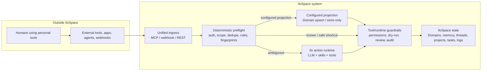
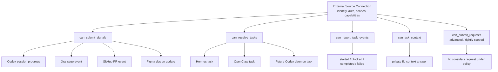
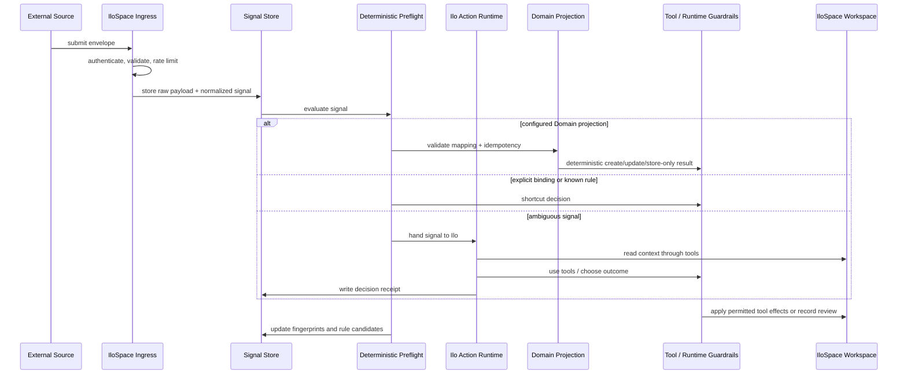
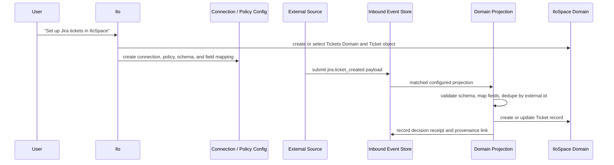
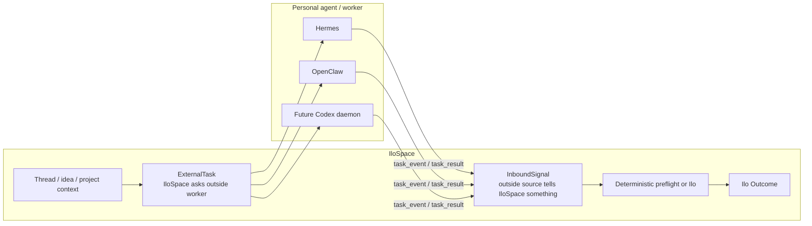
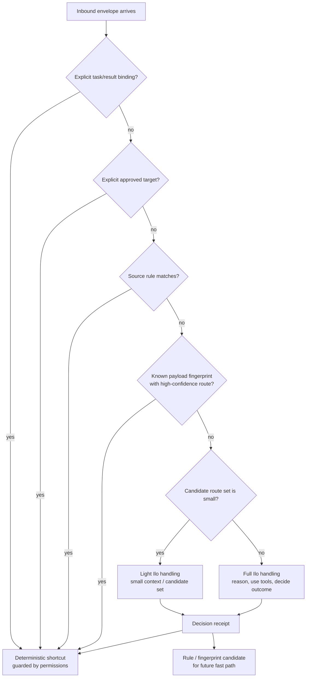
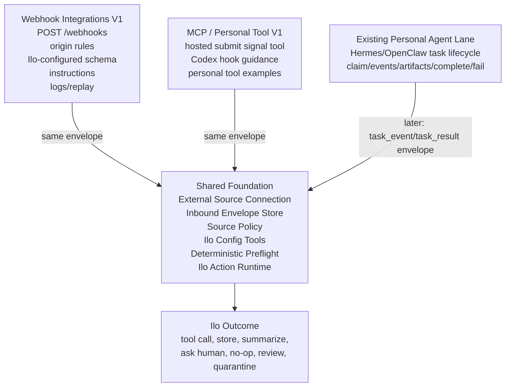

# PRD: Inbound Coordination Layer for IloSpace

Status: living PRD; foundation shipped in PR #113, Ilo-admin configuration tool and Phase 2 triage handoff implemented in `codex/illo-inbound-admin-tools`; triage reconciliation and token compatibility backfill implemented in `codex/inbound-token-reconcile`
Date: 2026-05-18  
Owner: product/architecture discussion  

## Implementation Status After PR #113 And Admin Tool Slice

PR #113 merged the first foundation slice. The follow-up admin tool slice adds the missing Ilo-facing configuration surface for the deterministic inbound lane. Phase 2 adds the first active Ilo triage handoff for ambiguous inbound signals. Together, they still do **not** complete the entire PRD.

The PRD intentionally describes a broader product direction: external tools send signals into IloSpace, IloSpace records and preflights them, and Ilo can configure every integration behavior by chatting with the user. The merged work delivered the shared ingress foundation and two concrete ingress lanes. The admin tool slice makes the shipped deterministic lane configurable by Ilo, without adding a manual configuration UI.

### Shipped In PR #113

- Shared inbound models and migration for inbound source connections, inbound events, receipts/effects, source policies, and Domain Projection support.
- Internal `submit_inbound_envelope` service used by both webhook and MCP lanes.
- Public `POST /webhooks` ingress through the deployed proxy.
- Source identity/auth checks for inbound sources.
- Origin policy matching for configured webhook/source policies.
- Raw inbound event storage, status tracking, and idempotency behavior.
- Domain Projection execution for configured projections that create/update existing IloSpace Domain records.
- Hosted MCP `illo_submit_signal` tool for Codex-like personal tools.
- MCP signal envelope construction with summary, origin, payload, hints, desired outcome, repo/branch/task/files/session metadata, and idempotency key.
- MCP scope gate for signal submission using `signal:submit`.
- Existing direct thread MCP tools preserved as advanced/compatibility surfaces and described as non-default for routine progress hooks.
- Tests for webhook receipt, auth/scope behavior, origin policy matching, idempotency, Domain Projection, MCP signal envelope construction, MCP tool descriptions, async DB boundaries, models, migrations, and deploy safety.
- Local real Docker smoke test covering webhook receipt, MCP-style signal receipt, idempotent replay, and Domain Projection before deployment.

### Shipped In `codex/illo-inbound-admin-tools`

- Ilo-facing `manage_inbound` tool registered for coordinator and worker agents.
- Chat-configurable External Source Connections with user/org authority context.
- Least-privilege token minting for inbound signal sources, defaulting to `signal:submit`.
- Source token metadata listing/get and token revocation without re-exposing raw token secrets.
- Source policy creation/update/list/get with origin patterns, envelope kinds, instructions, schema config, allowed actions, thresholds, review mode, metadata, and enabled/priority controls.
- Domain Projection creation/update/list/get for deterministic writes into existing IloSpace Domains.
- Policy/projection safety check that a projection policy belongs to the same connection.
- Automatic `domain_projection.upsert` permission on the policy when Ilo creates a projection for that policy.
- Inbound event listing/get with optional raw payload and normalized envelope details.
- Decision receipt listing/get through event detail inspection.
- Dry-run matching so Ilo can test a sample origin/payload against the current policy/projection config without storing an event.
- Action manifest/read-only policy metadata so read operations stay inspectable and mutating config/token operations remain high-risk audited actions.
- Tests proving Ilo can configure a connection, mint a scoped token, create policy/projection config, dry-run routing, process a real inbound envelope through that config, and inspect logs/receipts.

### Shipped In Phase 2 Triage Handoff

- Review-required inbound outcomes now create an inbound-origin Cortex Idea and seed a thread message for Ilo.
- The triage thread message carries the signal reason, source identity, origin, summary, desired outcome, policy instructions when present, hints, and a bounded payload preview.
- The inbound service admits an Ilo Cortex run through the shared `work_intake` API instead of writing to the run store directly.
- Decision receipts for ambiguous events now persist the triage target (`cortex_idea`) and tool-use handoff (`illo_triage`) with run id when admission succeeds.
- Webhook and MCP signals share the same triage path when no source policy matches.
- Matched policies without a deterministic projection, and policies whose projection action is not allowed, route into Ilo triage instead of stopping as passive store-only review.
- Projection validation failures configured as `review_required` route into Ilo triage; `quarantined` and `failed` outcomes remain terminal.
- Tests prove ambiguous webhook/MCP signals queue triage runs, create thread context, persist receipt target/tool-use metadata, and preserve the work-intake architecture boundary.

### Latest Progress In This Branch

- Added final-result reconciliation for inbound triage runs when Ilo reaches a terminal run status.
- Inbound events that were handed to Ilo now move from `review_required` to `processed` after a completed Ilo run, or `failed` after a failed/canceled/expired run.
- Decision receipts now retain the original triage handoff and also record run status, reconciliation timestamp, completion timestamp when available, and final answer text when Ilo produced one.
- Added a compatibility service and Alembic migration to grant `signal:submit` to old active personal-agent bridge tokens that predate PR #113.
- Backfill is restricted to active personal-agent-like connections (`hosted_mcp`, `bridge_pull`, or known personal-agent kinds such as Codex/Hermes/OpenClaw/OpenCode/Claude Code), and does not widen arbitrary webhook/custom tokens.
- Migration downgrade deliberately does not remove `signal:submit`, because post-upgrade user grants cannot be distinguished from automatic backfill safely.
- Ran a behavior-preserving simplification pass over the new admin service and tool handler.
- Simplified repeated response serialization in `manage_inbound`.
- Consolidated repeated string-list cleanup in the inbound admin service.
- Removed dead helper code from the admin service.
- Added Phase 2 triage handoff for review-required inbound signals.
- Kept the public tool schema, return payloads, auth behavior, and deterministic processing semantics unchanged.
- Verification after simplification:
  - `git diff --check`: passed.
  - Python compile check for touched modules/tests: passed.
  - Focused inbound/admin/triage safety suite: `63 passed, 1 skipped`.
  - Focused inbound/external-agent/MCP/migration suite: `80 passed, 2 skipped`.
  - Focused triage reconciliation tests for completed and failed runs: passed.
  - Focused token backfill test: passed.

### Partially Shipped

- **Decision receipts/effects**: inbound processing stores receipts/effects and now reconciles terminal Ilo triage run status/final answer back onto the event and receipt. Rich action-level capture is still future work because Ilo's later tool calls are not yet attributed back to the inbound event.
- **Source policies**: deterministic policy matching exists and Ilo can configure it, but learned rule promotion and payload fingerprinting are still future work.
- **Domain Projection**: deterministic configured projection works and Ilo can create/edit it, but projection targets still require an existing Domain/schema.
- **Ilo Action Runtime**: ambiguous events now enter Ilo's normal Cortex run path, and run completion reconciles the inbound receipt. Fine-grained action-result capture and learned-rule promotion are still future work.
- **MCP token scopes**: newly minted/default bridge tokens include `signal:submit`, and a compatibility migration/backfill grants it to old active personal-agent tokens. Arbitrary non-agent webhook/custom tokens still require explicit configuration.
- **Observability**: Ilo can inspect stored events and receipts, but there is not yet a first-class inbound monitor, replay surface, or UI.

### Not Yet Shipped

- Ilo-facing tools for replay jobs, rule candidates, learned payload fingerprints, and automatic rule promotion.
- Fine-grained final action reconciliation after an Ilo triage run completes: attributing actual workspace tool calls, no-op decisions, questions, summaries, or scheduled follow-ups back to the inbound event beyond the run's final answer/status.
- Rule learner / payload fingerprint promotion from repeated Decision Receipts into deterministic policy.
- Replay harness for historical inbound signals against current policy without mutating workspace state.
- Source cards or a durable summary of what each connection sends, common payload shapes, known rules, and current errors.
- Native monitoring Cycle/app/Domain setup for inbound webhook/MCP activity.
- A richer token rollout report/observability view showing which legacy personal-agent tokens were backfilled and which non-agent tokens still need explicit configuration.

### Recommended Next Slice

1. **Merge and deploy `manage_inbound`** so Ilo can actually configure the inbound layer in production chat.
2. **Run one real Ilo-driven configuration smoke test**:
   - Ask Ilo to create or inspect a source connection.
   - Ask Ilo to mint a `signal:submit` token.
   - Ask Ilo to create a policy and Domain Projection for a known test payload.
   - Send a webhook or MCP signal through the configured lane.
   - Ask Ilo to inspect the event and receipt.
3. **Run one real ambiguous-signal smoke test**:
   - Send a webhook or MCP signal that has no matching deterministic policy.
   - Confirm the inbound event stores `review_required`.
   - Confirm a Cortex Idea/thread/run is created for Ilo triage.
   - Let the run processor act and inspect what Ilo decides.
4. **Deploy the token backfill/reconciliation slice** and confirm the existing Codex MCP token can call `illo_submit_signal` without rotation.
5. **Add a replay/dry-run harness beyond single-event matching** so historical inbound events can be evaluated against current policies without mutating Domains.
6. **Add Source Cards / connection summaries** so Ilo can remember common origins, payload shapes, configured rules, recent failures, and what each external source is for.
7. **Add fine-grained Ilo action attribution** so receipt reconciliation can say which workspace tools/actions Ilo actually chose after triage, not only the terminal run status/final answer.

### Trace-Based Follow-Up

After deployment, Codex sent a compatibility-thread update to Ilo and inspected the exported thread trace. Ilo correctly understood the rollout and could use general workspace tools (`manage_domain`, `manage_workspace_app`, `manage_cycle`, `manage_idea`), but it did not have native inbound-admin tools yet. That confirmed the next implementation slice should be the **Ilo Configuration Tool Surface**, not another manual UI. The `manage_inbound` tool in this branch is that slice.

## Naming And Scope

This PRD uses the following vocabulary deliberately:

- **IloSpace** means the whole workspace, codebase, product, and team coordination system.
- **Ilo** means the agent that lives inside IloSpace: the LLM-powered coordinator that can reason, use skills, and call tools.
- **External Source Connection** means any outside tool, app, agent, webhook source, IDE, script, or personal worker connected to IloSpace.
- **Inbound Signal** means something an external source tells IloSpace happened.
- **External Task** means work IloSpace asks an external source to do.
- **Ilo Outcome** means the result of Ilo handling a signal. It may be a tool call, a workspace mutation, a stored note, a summary, a question to a human, a no-op, a scheduled follow-up, or another action Ilo can perform with its available skills and tools.

Current implementation and repo docs may still use the existing `Illospace` / `Illo` spelling and `illo_*` API/tool prefixes. This PRD is about product architecture and uses the requested conceptual distinction: **IloSpace is the system; Ilo is the agent**.

## Problem Statement

Teams increasingly work through many personal and external tools: Codex, Hermes, OpenClaw, Claude Code, OpenCode, Figma, Jira, GitHub, Linear, scripts, webhooks, and future agents. Each tool can generate useful work context, but today those tools either need to know exactly where to write in IloSpace or they need a human to manually copy updates into the right thread.

That creates the wrong burden. External tools are good at doing local work, observing their own state, and sending factual updates. They are not the right place to decide how team context should be organized across IloSpace threads, ideas, pins, projects, notifications, and agent runs.

At the same time, routing every incoming event through a full Ilo reasoning loop would be too slow, expensive, and noisy. A Jira webhook that always sends the same issue event should not make Ilo repeatedly rediscover what Jira is, what the payload means, and where it probably belongs. Repeated judgment should become reusable system knowledge.

The product needs a bare but strong foundation for inbound coordination:

- external tools submit signals and intent into IloSpace;
- IloSpace records, authenticates, normalizes, dedupes, and applies known policy deterministically;
- Ilo handles ambiguity and chooses what to do using its skills and tools when the deterministic layer cannot safely shortcut;
- repeated Ilo handling decisions become decision receipts, learned patterns, and eventually deterministic rules;
- personal agents can still receive tasks from IloSpace without being conflated with simple inbound webhook sources.

## Solution

Build a generalized **External Source Connection + Inbound Signal** layer in IloSpace.

Every outside system is represented as an External Source Connection with identity, auth, scopes, and capabilities. A connection may be a personal agent, a coding tool, a webhook app, a design tool, a code host, or a custom script. The important distinction is not the product name; it is what the connection can do.

Connections can have capabilities such as:

- submit inbound signals;
- receive external tasks from IloSpace;
- report task events and task results;
- ask Ilo for private workspace context;
- submit explicit requests for Ilo to consider, when strongly scoped and explicitly targeted.

The default inbound API/MCP/webhook primitive should be signal submission, not direct workspace mutation. External tools should generally say:

> “Here is something that happened; IloSpace should decide what to do with it.”

They should not generally say:

> “Post this to that thread and trigger Ilo.”

IloSpace should route incoming envelopes through deterministic preflight first. If the signal has an explicit task binding, explicit approved target, source rule, idempotency match, known payload fingerprint, or learned pattern, IloSpace can resolve the envelope without invoking Ilo. If the signal is ambiguous, Ilo handles it directly: it reasons over the signal, uses its available tools and skills, chooses whether anything should happen, and records a Decision Receipt. Over time, repeated receipts can promote into source rules or learned patterns so future events bypass or minimize Ilo reasoning.

Existing Hermes/OpenClaw work remains valuable. It becomes the first implemented specialization of this broader model: a personal-agent connection that can receive outbound tasks and report results. Jira/GitHub/Figma-style sources are connections that mostly submit inbound signals. Codex can be either: a normal session may only submit signals, while a long-running Codex daemon could also receive tasks.

## Ilo-First Configuration Principle

All configuration must be possible through Ilo. Users should configure inbound integrations, source policies, schemas, instructions, thresholds, tool-use/outcome permissions, replay tests, and rule promotion by chatting with Ilo.

V1 should not build an integration builder UI, schema builder UI, drag/drop priority UI, or manual settings dashboard. The implementation should build durable configuration services and expose them to Ilo as tools. A UI may emerge later on top of the same services, but it is not the product surface for this PRD.

Observability is allowed and useful, but it is not configuration. V1 may expose server-style logs, event details, dry-run results, replay results, and current config snapshots so humans can inspect what happened. Changes still go through Ilo.

The product principle is:

> If a human could configure it, Ilo must have a tool to configure it.

Ilo configuration and inbound handling should always have an authority principal. Even when the event comes from MCP, a webhook, or an external agent, the connection should resolve to the user who configured it, requested it, or owns that personal connection. Ilo acts on behalf of that user, and backend permission checks use that user/org context.

## V1 Alignment And Parallel Work Split

The webhook integration workstream and the MCP/personal-tool workstream should land on the same foundation. They are not competing designs. They are two ingress lanes into one inbound coordination layer.

The shared rule is:

> Different ingress, same envelope, same deterministic preflight, same Ilo action runtime.

### Shared Foundation Workstream

One implementation owner should build the smallest common backend path first. This path must be usable by both webhook integrations and hosted MCP tools.

The foundation owns:

- External Source Connection identity, auth, org/workspace scope, source type, capabilities, and status.
- Inbound Envelope persistence for raw payload, normalized payload, idempotency, status, source metadata, and processing result.
- Source Policy lookup for allowed envelope kinds, instructions, origin patterns, tool-use/outcome permissions, thresholds, review mode, and schema expectations.
- Deterministic policy evaluation before Ilo reasoning.
- Ilo action runtime interface that lets Ilo handle ambiguous signals using its available tools and skills.
- Decision Receipt persistence for outcome, confidence, target, tool use, reasoning summary, features used, and reusable-pattern candidate.
- Tool/runtime guardrails for permissions, review/quarantine outcomes, dry-run, and safe execution.
- Ilo configuration tools for every configurable field in the foundation.

The foundation should expose one internal service interface that both product surfaces call:

```text
submit_inbound_envelope(connection, envelope, ingress_context) -> InboundProcessingResult
```

The first stable envelope shape should be small:

```json
{
  "kind": "signal",
  "origin": "source.event_name",
  "payload": {},
  "summary": null,
  "hints": {},
  "desired_outcome": null,
  "idempotency_key": null
}
```

The first result shape should make review/debugging possible:

```json
{
  "status": "processed | review_required | quarantined | failed",
  "event_id": "inbound-event-id",
  "matched_policy_id": "policy-id-or-null",
  "ilo_outcome": {},
  "confidence": 0.91
}
```

### Webhook Integrations Workstream

This is the colleague’s V1 lane. It should implement configured inbound integrations around `POST /webhooks`, while calling the shared foundation service rather than building a separate webhook-only processing stack.

Webhook V1 owns:

- Public webhook ingress.
- Authenticated integration connection or integration token.
- Minimal external payload: `origin` and `payload`, plus optional idempotency/header metadata.
- Origin pattern matching with explicit priority/order.
- Incoming schema configuration model that Ilo can populate through tools and the backend can compile to internal JSON Schema or equivalent validation.
- Integration instructions for Ilo handling.
- Allowed outcomes/tool use and auto-execute thresholds.
- Optional Domain Projection configuration, created by Ilo, for sources that should store structured records without requiring Ilo reasoning on every event.
- Dry-run/test payload flow.
- Event logs.
- Replay.
- Read-only observability endpoints/views if needed for logs, event details, dry-run results, replay results, and config snapshots.

The webhook proposal maps directly to the shared model:

```text
integrations                  -> External Source Connections / Source Policies
POST /webhooks                -> webhook ingress
origin + payload              -> Inbound Envelope
origin_patterns + priority    -> deterministic source policy matching
integration_events            -> Inbound Envelope/Event Store
LLM strict plan               -> Ilo outcome / receipt
allowed_outcomes/tool_use + thresholds  -> tool/runtime guardrails
event logs + replay           -> receipt/replay/audit tooling
```

For V1 webhook outcomes:

- Ilo may open a Cortex thread above threshold when source policy permits it.
- Ilo may create memory above threshold when source policy permits it, but the result must preserve source provenance and remain easy to inspect/delete.
- Ad hoc Domain writes proposed by Ilo while handling an ambiguous payload must start in review/dry-run, because Ilo is inventing or choosing structured writes at event time.
- Configured Domain Projections may auto-create or auto-update records when Ilo has already created or selected the Domain, object type, field mapping, external id strategy, principal, and policy. In that path, each event still stores a raw inbound event first, then deterministic validation/upsert writes into the Domain if the projection contract passes.

Webhook integrations have a **source actor identity** and an **authority principal**. The source actor identifies the external system that sent the event. The authority principal is the user who configured, requested, or owns that source connection. Ilo acts and permissions are checked under the authority principal, while provenance still shows the external source actor. Both must be scoped to one IloSpace workspace/org and must never imply cross-org global write access.

### MCP / Personal Tool Signal Workstream

This is the Codex/personal-tool lane. It should implement a hosted MCP tool that submits the same Inbound Envelope shape through the same foundation service.

MCP V1 owns:

- Hosted MCP tool conceptually named `submit signal` or `illo_submit_signal`.
- Tool description that clearly tells coding agents and personal tools not to pick threads or mutate workspace state by default.
- Input shape aligned with the shared envelope.
- Good defaults for coding-session updates: progress summary, repo/branch hints, files touched, task title, source tool, and desired outcome.
- Codex hook guidance showing when a personal tool should submit a signal.
- Examples for Codex, Claude Code, OpenCode, and other personal work tools.
- Regression tests ensuring default MCP guidance points clients toward signal submission rather than direct thread mutation.

The MCP lane should treat direct `create_thread` / `post_thread_message` style tools as advanced or compatibility tools, not the default path. The default path is:

```text
Personal tool -> hosted MCP submit signal -> Inbound Envelope -> Source Policy -> deterministic preflight or Ilo action runtime -> Ilo Outcome
```

The MCP lane should not block on webhook observability surfaces. It only needs the shared foundation service and a connection/token with `can_submit_signals`.

### Existing Hermes/OpenClaw Compatibility Workstream

The existing personal-agent task lane should remain intact while the inbound foundation lands.

For now:

- Keep External Tasks for IloSpace-to-personal-agent delegation.
- Keep task claim/event/artifact/complete/fail behavior working.
- Keep hosted personal-agent MCP reads and headless asks working.

Later:

- Task events and task results can be represented as bound Inbound Envelopes.
- Hermes/OpenClaw can also use `submit signal` for free-form progress outside a delegated task.

### First Shared Milestone

The first implementation milestone is successful when these two ingress paths create the same internal kind of record and use the same processing service:

```text
POST /webhooks
origin = jira.ticket_created
payload = {...}
```

and:

```text
MCP submit signal
origin = codex.progress
payload/summary = {...}
```

Both must produce:

- an authenticated External Source Connection;
- a stored Inbound Envelope/Event;
- a matched Source Policy or default policy;
- a deterministic decision or Ilo Decision Receipt;
- an Ilo Outcome or review/quarantine outcome;
- provenance visible in logs and any workspace projection.

## Two-PR Parallel Ownership Plan

The implementation should be split so JB and Reda can work in parallel, test their own lanes independently, and then run shared integration tests after both PRs are merged together.

The shared contract must be agreed before coding:

- `submit_inbound_envelope(connection, envelope, ingress_context) -> InboundProcessingResult`
- envelope shape, result shape, status enum, source actor, authority principal, idempotency behavior, and provenance expectations;
- table/model names for external source connections, inbound events, source policies, Domain Projections, and Decision Receipts;
- rule that all configuration is done through Ilo tools, not a manual configuration UI.

If one PR lands the shared contract first, the other PR should rebase onto it. If both PRs are developed at the same time, Reda's MCP PR may mock the shared service in tests, but the mock is only a test boundary. Production behavior must call the real shared service after the PRs are merged.

### JB PR: Webhook Foundation + Domain Projection

JB owns the webhook/configured-source lane and the backend foundation needed by both lanes.

JB implementation scope:

- DB models and migrations for External Source Connections, Inbound Events, Source Policies, Domain Projections, Decision Receipts or Event Effects.
- The real `submit_inbound_envelope` service implementation.
- Public `POST /webhooks` ingress.
- Webhook authentication / integration token handling.
- Origin pattern matching and priority/order evaluation.
- Raw payload storage, normalized payload storage, idempotency, status transitions, and replayable event state.
- Ilo-configurable source policy fields needed for webhooks.
- Ilo-configurable Domain Projection fields: Domain id, object key, external id field, field mapping, upsert mode, validation behavior, review/quarantine behavior, and authority principal.
- Domain Projection engine that writes into existing IloSpace Domains after validation and idempotency.
- Webhook logs, dry-run, replay, and server-side observability needed for debugging.

JB independently testable before merge:

- A webhook fixture stores an Inbound Event even when no policy exists.
- Authenticated source identity is required; `origin` alone never proves source identity.
- Origin matching chooses the expected active policy.
- Idempotency prevents duplicate processing.
- A configured Jira-like Domain Projection creates and updates a Domain record.
- Invalid mapped Domain data goes to review/quarantine instead of silently writing.
- The authority principal is used for permission checks while the source actor remains visible in provenance.

JB should not own in this PR:

- Hosted MCP tool UX and schema.
- Codex hook guidance.
- Personal-tool examples.
- Changing the existing Hermes/OpenClaw task lifecycle except where needed for shared connection compatibility.

### Reda PR: MCP / Personal Tool Signal Lane

Reda owns the personal-tool lane: how Codex-like tools submit work progress and intent into IloSpace without choosing workspace destinations themselves.

Reda implementation scope:

- Hosted MCP tool conceptually named `illo_submit_signal` or the final agreed equivalent.
- MCP tool schema aligned with the shared Inbound Envelope contract.
- Tool description that tells personal tools to submit signals, not pick threads or mutate workspace state by default.
- Auth/scope checks for MCP signal submission using the existing external-agent or connection-token pattern where possible.
- Envelope construction for coding-session updates: source tool, repo, branch, task title, summary, files touched, run/session hints, desired outcome, and idempotency key.
- Codex hook guidance and examples for Codex, Claude Code, OpenCode, and similar tools.
- Compatibility review of existing `create_thread` / `post_thread_message` style MCP tools so they are advanced/compatibility surfaces rather than the default automatic-hook path.

Reda independently testable before merge:

- MCP tool schema accepts a Codex-style progress signal.
- MCP tool rejects or refuses unsupported direct workspace mutation behavior.
- MCP tool calls the shared `submit_inbound_envelope` contract with the expected envelope.
- Tests may mock `submit_inbound_envelope` until JB's foundation branch is merged.
- Tool descriptions and examples steer agents toward signal submission rather than deterministic thread selection.

Reda should not own in this PR:

- Public webhook ingress.
- Origin pattern matching for webhook integrations.
- Domain Projection execution.
- Inbound persistence migrations, unless JB explicitly asks Reda to take the shared foundation first.

### After PR #113 And Admin Tool Slice Merge

The original split expected these tests to be blocked until the webhook/MCP foundation and admin surface were merged together. Current status:

- Real MCP `illo_submit_signal` persists through JB's real `submit_inbound_envelope` service: shipped in PR #113 and covered by tests.
- Webhook and MCP inputs produce the same internal record types and status transitions: shipped in PR #113 and covered by tests.
- `origin = jira.ticket_created` and `origin = codex.progress` both exercise the same Inbound Event store and Decision Receipt path: shipped in PR #113 and covered by tests.
- Ilo can configure a source policy / Domain Projection, then a webhook event uses that configuration without per-event Ilo reasoning: implemented in `codex/illo-inbound-admin-tools` and covered by tests.
- Replay works for both webhook-created and MCP-created inbound events: still future work.
- Provenance shows both source actor and authority principal for webhook and MCP lanes.

## Architecture Diagrams

### 1. Conceptual Boundary



### 2. Connection Capability Model



### 3. Inbound Signal Flow



### 3B. Configured Domain Projection Flow



### 4. External Tasks Versus Inbound Signals



### 5. LLM Bypass Ladder



### 6. Parallel Workstreams



## User Stories

1. As a teammate using Codex, I want Codex to submit a progress signal to IloSpace, so that the team can stay aware of meaningful work without me manually writing a status update.
2. As a teammate using any personal coding tool, I want the tool to submit the same kind of signal shape, so that IloSpace does not need a Codex-specific design.
3. As a teammate using Hermes or OpenClaw, I want my personal agent to share progress back into IloSpace, so that external autonomous work becomes visible to the team.
4. As a teammate using Hermes or OpenClaw, I want IloSpace to delegate work to my personal agent, so that I can use my preferred agent without leaving the team coordination layer.
5. As a teammate using a future Codex daemon, I want IloSpace to delegate tasks to that daemon when it supports task receiving, so that Codex can be treated like a capable external worker rather than a special case.
6. As a teammate using Jira, I want Jira issue events to enter IloSpace as signals, so that relevant project activity can be routed into team context.
7. As a teammate using GitHub, I want pull request and issue activity to enter IloSpace as signals, so that engineering changes can be connected to threads, projects, and pins.
8. As a designer using Figma, I want design updates to enter IloSpace as signals, so that design work can be coordinated with engineering and product threads.
9. As an authorized teammate chatting with Ilo, I want Ilo to register an External Source Connection, so that each outside source has identity, auth, scopes, and capabilities without me using a settings UI.
10. As an authorized teammate chatting with Ilo, I want Ilo to configure whether a connection can submit signals, receive tasks, report task events, ask for context, or submit explicit requests for Ilo to consider, so that each source has the minimum required power.
11. As an authorized teammate chatting with Ilo, I want Ilo to configure source-specific webhook policies, so that common payloads can be normalized and routed cheaply.
12. As an authorized teammate chatting with Ilo, I want Ilo to create scoped, revocable, auditable connection tokens, so that external sources never need broad internal service credentials.
13. As an authorized teammate chatting with Ilo, I want Ilo to surface repeated source behavior and proposed rules, so that IloSpace becomes faster and cheaper over time.
14. As an authorized teammate chatting with Ilo, I want Ilo to approve, reject, or modify proposed routing rules according to my instructions and permissions, so that learned automation stays understandable and governed.
15. As an authorized teammate chatting with Ilo, I want Ilo to inspect a connection’s recent signals, task events, failures, and decisions, so that I can debug integrations conversationally.
16. As an authorized teammate chatting with Ilo, I want low-confidence or sensitive outcomes to require human confirmation through Ilo, so that external automation cannot silently create messy or risky workspace state.
17. As Ilo, I want incoming signals to include raw payload, normalized fields, hints, source identity, and policy context, so that I can handle ambiguity only when deterministic preflight is insufficient.
18. As Ilo, I want every ambiguous handling decision to produce a receipt, so that future signals can reuse prior judgment without repeating full reasoning.
19. As Ilo, I want deterministic rules and payload fingerprints to handle common cases, so that my LLM reasoning is reserved for ambiguity.
20. As Ilo, I want deterministic preflight to narrow candidate context when possible, so that I can handle the signal with less context and fewer tokens.
21. As Ilo, I want to create a new idea/thread when no suitable home exists, so that novel signals are not forced into the wrong context.
22. As Ilo, I want to post to an existing thread when the signal clearly belongs there, so that team progress stays attached to prior discussion.
23. As Ilo, I want to link signals to projects and pins, so that broader subjects can accumulate activity across many threads.
24. As Ilo, I want to ignore or privately store low-value signals, so that the workspace does not become noisy.
25. As Ilo, I want to trigger an agent run only when the signal calls for active reasoning or action, so that not every update becomes work.
26. As a teammate reading a thread, I want external updates to show their source and provenance, so that I understand where the information came from.
27. As a teammate reading a thread, I want task results from Hermes/OpenClaw/future workers to appear in the right thread automatically, so that delegated work closes the loop.
28. As a teammate reading a project, I want related external signals to be linked or summarized, so that project context includes work happening outside IloSpace.
29. As a teammate, I want the system to distinguish factual signal submission from explicit requests to Ilo, so that personal agents do not accidentally take over coordination decisions.
30. As a teammate, I want to explicitly ask Ilo through an external tool for a known outcome when needed, so that precise human-directed requests are still possible without making the external tool own coordination.
31. As a coding agent, I want a simple `submit signal` tool, so that I do not need to search the workspace, pick a thread, and decide whether to trigger Ilo.
32. As a coding agent, I want tool descriptions to make the default behavior clear, so that I submit intent instead of mutating workspace state directly.
33. As a webhook integration, I want a stable ingestion endpoint, so that events can enter IloSpace without pretending to be personal agents.
34. As a webhook integration, I want payload normalization recipes, so that repeated payload shapes become typed signals.
35. As a webhook integration, I want idempotency and replay protection, so that retries do not create duplicate updates.
36. As a system operator, I want raw payload storage with redaction policy, so that integrations are auditable without leaking unnecessary sensitive data.
37. As a system operator, I want rate limits per connection and source type, so that noisy external systems cannot overwhelm IloSpace.
38. As a system operator, I want source policy to define default visibility, allowed tool use/outcome boundaries, and escalation behavior, so that each integration has predictable guardrails.
39. As a system operator, I want routing receipts to be searchable, so that I can understand why IloSpace posted, created, linked, ignored, or asked for help.
40. As a product builder, I want the existing Hermes/OpenClaw task lifecycle to remain intact, so that current personal-agent work does not need to be rewritten.
41. As a product builder, I want inbound signals to be separate from external tasks, so that Jira/GitHub/Figma events do not pollute the task lifecycle model.
42. As a product builder, I want shared auth and connection concepts across signals and tasks, so that the foundation stays simple even as capabilities differ.
43. As a product builder, I want direct workspace mutation tools to be internal Ilo tools, so that the default external MCP does not teach agents to route or mutate workspace state by themselves.
44. As a product builder, I want explicit external requests to be interpreted by Ilo and guarded by policy, so that precise user intent remains possible without bypassing coordination.
45. As a product builder, I want learned rules to be generated from receipts rather than hidden memory calls, so that the system’s learning is durable and inspectable.
46. As a product builder, I want a replay harness for old signals and receipts, so that routing policy changes can be tested against real historical examples.
47. As a product builder, I want source cards that summarize connection behavior, common payloads, rules, and examples, so that integration behavior is understandable at a glance.
48. As a teammate, I want IloSpace to coordinate among personal agents rather than compete with them, so that I can keep my preferred tools while the team gains shared context.
49. As a webhook integration builder, I want my `POST /webhooks` implementation to call the same inbound envelope service as MCP signal submission, so that the webhook lane does not drift into a separate architecture.
50. As an MCP integration builder, I want my hosted MCP tool to call the same inbound envelope service as webhooks, so that Codex-style progress updates and Jira-style webhook events become comparable system inputs.
51. As a product builder, I want a clear foundation workstream, webhook workstream, and MCP workstream, so that multiple people can build in parallel without stepping on each other.
52. As a webhook integration builder, I want ad hoc Domain writes to start as review/dry-run, so that ambiguous payload handling cannot silently invent structured records.
53. As a webhook integration builder, I want integrations to act as workspace/org-level system actors rather than user-owned actors, so that incoming Jira/GitHub/Stripe events are not incorrectly attributed to one teammate.
54. As a security-minded admin, I want integration actors to remain scoped to one workspace/org, so that “system actor” never means cross-org global write access.
55. As a coding agent, I want the hosted MCP tool to accept repo, branch, task, and file hints, so that IloSpace can route progress without forcing me to choose a thread.
56. As an operator, I want the first shared milestone to prove webhook and MCP inputs produce the same internal records, so that the foundation is real and not just conceptual.
57. As an authorized teammate, I want to configure integrations by chatting with Ilo rather than filling out forms, so that IloSpace stays agent-native instead of becoming another settings dashboard.
58. As Ilo, I want tools for every configurable integration field, so that I can create and update connections, policies, schemas, thresholds, tool-use permissions, tests, replays, and rule promotions on behalf of authorized users.
59. As a teammate, I want observability surfaces to be read-only by default, so that I can inspect events and logs without confusing logs with the configuration experience.
60. As an authorized teammate chatting with Ilo, I want Ilo to create or select a Domain and configure a source-to-Domain projection, so that repeated Jira/GitHub/Stripe-style events can be stored as structured records without invoking Ilo on every event.
61. As a teammate, I want every projected Domain record to keep source provenance and inbound event linkage, so that I can trace a record back to the external payload and replay or audit the import.

## Implementation Decisions

- Add a generalized External Source Connection concept that is capability-based, not product-name-based. Hermes, OpenClaw, Codex, Jira, GitHub, Figma, and custom scripts are all connections with different capabilities.
- Build configuration services first, then expose those services to Ilo as tools. Do not make a manual configuration UI the V1 product surface.
- Every configurable field must have an Ilo-accessible tool path: connections, capabilities, source policies, origin patterns, instructions, schema fields, tool-use permissions, thresholds, dry-run inputs, replay, rule candidates, and source status.
- Treat logs, dry-run output, replay output, and config snapshots as observability surfaces, not the primary configuration surface.
- Use one shared inbound service for webhook, MCP, and future inbound lanes. Do not build a webhook-only service that cannot be reused by the hosted MCP tool.
- Implement the shared foundation before or alongside the first webhook/MCP slices. Both product lanes should call `submit_inbound_envelope` or an equivalent service boundary.
- Treat the colleague’s webhook proposal as the first configured-source implementation of the broader inbound architecture.
- Treat the Codex/MCP proposal as the first personal-tool signal implementation of the broader inbound architecture.
- Separate source actor identity from authority principal. A webhook may be provenance-attributed to Jira, GitHub, or Stripe, but Ilo handling and tool permission checks must resolve to the user who configured, requested, or owns the connection.
- Require authenticated source identity for public webhook ingress. The `origin` string is routing metadata, not proof of identity.
- Preserve the existing personal-agent task model for outbound delegation. It is the right shape for long-running remote work with status, artifacts, and completion.
- Do not stretch the external task lifecycle to represent arbitrary inbound webhook or progress events. Add a separate inbound signal model.
- Introduce an inbound envelope contract that can represent `signal`, `request`, `task_event`, and `task_result`.
- Treat `signal` as the default for external observations: progress updates, webhook events, design updates, ticket changes, and code host activity.
- Treat `request` as an external source asking IloSpace to consider doing something, without assuming the source gets to mutate the workspace directly.
- Treat `task_event` and `task_result` as deterministic updates tied to an existing External Task created by IloSpace.
- Add a default MCP/API/webhook entrypoint for signal submission. The preferred public tool should be conceptually named `submit signal`, even if the final code-level prefix follows existing naming conventions.
- Keep direct workspace mutation tools as internal Ilo tools, not the default external integration surface. Automatic hooks and general personal-agent MCP guidance should prefer signal/request submission.
- Route all inbound envelopes through IloSpace. The system may bypass Ilo reasoning through deterministic preflight, but external sources should not perform fuzzy routing themselves.
- Add a deterministic preflight layer before Ilo reasoning. It handles auth, scopes, validation, dedupe, idempotency, redaction, explicit task binding, explicit approved targets, source rules, payload fingerprints, and learned high-confidence patterns.
- Add Ilo handling only for ambiguous cases or cases where policy requires agent judgment.
- Add Decision Receipts as durable records of agent or policy decisions. Receipts should include signal id, outcome, target when relevant, tool use, confidence, reasoning summary, features used, whether a human was asked, and whether the decision is reusable.
- Add learned pattern support from repeated receipts. When many similar signals are routed the same way, IloSpace can propose a deterministic rule.
- Add source policies for each connection. Policies define allowed envelope types, default visibility, allowed outcomes/tool use, Ilo handling instructions, deterministic rules, confirmation thresholds, redaction behavior, and cost policy.
- Add Domain Projection policies for configured structured ingestion. A projection binds a source/origin pattern to a Domain, object type, field mapping, external id strategy, upsert mode, validation mode, owner principal, and review/quarantine behavior.
- Add payload fingerprints that hash stable source/event/schema/features rather than full payload content. Fingerprints should support fast recognition of repeated payload shapes.
- Add source cards as an operator-facing summary of each connection: what it sends, common payloads, known rules, examples, recent errors, and current capabilities.
- Add a replay harness that can run historical signals against current policy and handling settings without mutating the workspace.
- Keep personal-agent connection tokens and scoped auth as the template for future connection security. Do not use broad internal service tokens for external sources.
- Add connection capabilities rather than separate tables per source type wherever practical. Capabilities should make Codex, Hermes, OpenClaw, Jira, GitHub, and Figma differ by behavior, not by bespoke architecture.
- For personal agents that can receive tasks, the existing outbound bridge model remains valid: IloSpace creates an External Task; the worker claims or receives it; task events and results return as bound inbound envelopes.
- For sources that only send events, the source only needs signal submission capability.
- For Codex, support both modes conceptually: ordinary sessions submit signals; future long-running Codex workers may receive tasks.
- For Jira/GitHub/Figma, start with inbound-only signal connections and source policies.
- For webhook V1, support origin matching with explicit priority/order. The first active integration/policy whose rules match the authenticated source and origin wins.
- For webhook V1, support an Ilo-configurable schema field model that compiles to internal validation. Do not require users to hand-author raw JSON Schema and do not require a schema-builder UI in V1.
- For webhook V1, support dry-run and replay before expecting broad auto-execution.
- For webhook V1, define initial guardrails for Ilo tool use around opening Cortex threads, creating memory, ad hoc Domain write review, and configured Domain Projection execution. These are seed permissions for the Jira/webhook slice, not the global taxonomy of everything Ilo can do.
- For MCP V1, add one default signal submission tool and update tool descriptions/guidance so coding agents understand that fuzzy routing belongs to IloSpace.
- For MCP V1, keep direct thread tools as compatibility/advanced tools only if still needed. They must not be the recommended path for automatic progress hooks.
- For explicit user-directed commands, allow deterministic execution only when the target and permission are explicit. Example: a result tied to an existing task id can be posted back deterministically because IloSpace already knows the destination.
- Do not require every inbound signal to trigger a visible workspace update. Possible outcomes include store only, ignore as noise, ask human, use a tool, summarize, schedule follow-up, or trigger an Ilo run. This list is illustrative, not a boundary on Ilo's capabilities.
- Make provenance visible in workspace projections. Thread messages or linked records created from external signals should show source connection, source object, and whether Ilo or deterministic preflight made the decision.
- Keep IloSpace’s current product trigger system downstream of signal handling. Inbound signals are pre-trigger raw material; only selected Ilo outcomes should become triggers for agent runs.

### Proposed Deep Modules

- **Connection Registry**: owns external source identity, auth, scopes, capabilities, status, and source card metadata.
- **Ilo Configuration Tool Surface**: gives Ilo tools for every configurable connection, source policy, schema, action, threshold, dry-run, replay, and rule-promotion operation.
- **Inbound Envelope Store**: owns raw payloads, normalized signals, idempotency, redaction, and replayable state.
- **Signal Normalizer**: converts source-specific payloads into a stable inbound signal shape.
- **Policy Engine**: performs deterministic preflight decisions and decides whether Ilo handling is needed.
- **Domain Projection Engine**: validates configured source payloads, maps fields, dedupes by external id, and writes structured records into existing IloSpace Domains with provenance.
- **Ilo Action Runtime**: lets Ilo perform LLM-based interpretation and tool use only when policy cannot safely decide.
- **Decision Receipt Store**: records outcomes, features, confidence, targets when relevant, tool use, and reusable-pattern candidates.
- **Rule Learner**: turns repeated receipts into proposed or auto-promoted deterministic rules.
- **Tool Runtime Guardrails**: enforces permissions, dry-run, review, audit, and action safety around any tool effects.
- **Replay Harness**: replays historical envelopes through policy and handling simulation for regression testing.

### Agent-Ready Work Packages

#### Package A: Shared Foundation

Build the backend foundation used by both webhook and MCP ingress.

Deliverables:

- Connection capability model.
- Ilo configuration tools for connection and policy creation/update.
- Inbound envelope/event persistence.
- Source policy representation.
- Domain Projection representation for structured event storage.
- Internal `submit_inbound_envelope` service.
- Deterministic policy gate.
- Ilo action runtime interface.
- Decision receipt persistence.
- Tool/runtime guardrails with review/quarantine outcomes.
- Tests proving the same service can process a webhook-style and MCP-style envelope.

#### Package B: Webhook Integrations V1

Build the configured webhook product lane on top of Package A.

Deliverables:

- Public webhook ingress with authenticated source identity.
- Minimal payload shape: `origin` and `payload`.
- Origin pattern matching with priority.
- Ilo-configurable schema fields and backend validation.
- Ilo-configurable Domain Projection for events that should become structured records.
- Integration instructions.
- Allowed outcomes/tool use and auto-execute thresholds.
- Event logs, dry-run, replay.
- Read-only observability for event logs, dry-run results, replay results, and config snapshots.
- Jira-like fixture proving ticket handling into a configured Tickets Domain, review, or an Ilo-created thread depending on policy.

#### Package C: MCP / Personal Tool Signals V1

Build the hosted MCP signal lane on top of Package A.

Deliverables:

- Hosted MCP `submit signal` tool.
- Tool schema aligned with the shared envelope.
- Tool description optimized for coding agents and personal work tools.
- Codex hook guidance.
- Examples for Codex-style progress updates.
- Tests proving MCP signal submission creates the same internal records as webhook submission.
- Compatibility review of existing `create_thread` / `post_thread_message` tools so they are not the default recommendation.

#### Package D: Existing Personal-Agent Compatibility

Protect current Hermes/OpenClaw behavior while Packages A-C land.

Deliverables:

- Existing task claim/update/artifact/complete/fail routes keep passing.
- Existing hosted personal-agent MCP reads and headless asks keep passing.
- Compatibility notes for later representing task events/results as inbound envelopes.

## Testing Decisions

- Tests should focus on observable behavior: accepted/rejected envelopes, stored raw payloads, normalized signal shape, deterministic preflight decisions, receipts, Ilo outcomes, task updates, and permission failures.
- Avoid tests that assert internal prompt wording or implementation details of Ilo’s LLM reasoning.
- Add contract tests for the signal submission API/MCP/webhook entrypoints: auth, scope checks, idempotency, validation, redaction, and response shape.
- Add model/service tests for connection capabilities: a connection with only signal capability cannot claim tasks or bypass Ilo with direct workspace mutation.
- Add policy engine tests for deterministic bypass: explicit task result, explicit approved target, source rule, known fingerprint, unknown signal requiring Ilo handling.
- Add decision receipt tests: ambiguous signals produce receipts with outcome, confidence, target/tool use when relevant, and reusable-pattern metadata.
- Add rule learner tests: repeated similar receipts produce a proposed rule; low-confidence or conflicting receipts do not.
- Add tool/runtime guardrail tests: policy/Ilo decisions create or update the correct workspace projection without requiring the external source to call direct mutation tools.
- Add external task compatibility tests: existing Hermes/OpenClaw task claim, event, artifact, complete, and fail flows still work.
- Add regression tests around hosted MCP tool descriptions: default guidance should steer general clients toward signal submission, not direct thread mutation.
- Add webhook integration tests for at least one Jira-like source payload: raw payload stored, normalized signal created, idempotency applied, and routing policy evaluated.
- Add MCP integration tests for at least one Codex-like progress signal: raw/normalized signal stored, hints preserved, policy evaluated, and same service path used as webhook.
- Add shared-path tests proving webhook and MCP inputs both produce Inbound Envelope/Event records and Decision Receipts/results through the same foundation service.
- Add security tests proving a claimed `origin` alone cannot impersonate another source.
- Add org/workspace scope tests proving integration actors are system actors inside one org/workspace, not global cross-org actors.
- Add tool-gating tests proving ad hoc domain record creation stays review/dry-run in V1 unless an explicit Ilo-configured Domain Projection exists.
- Add Domain Projection tests proving a configured Jira-like ticket event can create/update a Domain record deterministically after raw event storage, validation, idempotency, and permission checks.
- Add replay harness tests: a fixture set of historical signals can be evaluated without mutating workspace state.
- Use existing external-agent service and route tests as prior art for scoped token auth, task lifecycle, hosted MCP, and bridge route behavior.
- Use existing trigger/work-intake tests as prior art for downstream run admission after an Ilo outcome requires an agent run.

## Out of Scope

- Replacing Hermes/OpenClaw task delegation.
- Building a full public A2A protocol implementation.
- Building source-specific deep integrations for every app in the first pass.
- Renaming all existing code identifiers from current `illo_*` naming.
- Guaranteeing fully autonomous rule promotion without operator visibility.
- Building a manual configuration UI for source policy fields in the first implementation.
- Making UI the configuration surface for integrations.
- Making all external tools always-on personal agents.
- Letting external sources perform fuzzy workspace routing directly.
- Treating Jira/GitHub/Figma events as external tasks.
- Making every inbound signal visible to the team.
- Making every inbound signal trigger an Ilo run.

## Further Notes

The most important product principle is:

> External tools submit signals and intent. IloSpace owns coordination. Ilo handles ambiguity. Deterministic policy handles the repeated and obvious.

This lets IloSpace become the team coordination layer without competing with personal agents. Hermes, OpenClaw, Codex, Figma, Jira, GitHub, and future tools can keep doing their local work. IloSpace turns their outputs into shared context, durable memory, team-visible progress, and actionable coordination.

The existing personal-agent MVP already proved useful pieces: scoped connection tokens, external task lifecycle, task events, artifacts, hosted MCP, bridge-first delegation, and public/private interaction modes. The new inbound coordination layer should reuse those lessons while introducing the missing primitive: a durable Inbound Signal that Ilo can handle through deterministic preflight or agent reasoning.

Direct thread creation/posting should be treated as internal Ilo tool use, not the default external surface shown to hooks, webhooks, or autonomous personal agents. The default external surface should be signal/request submission into IloSpace.

The architecture should intentionally support a future where IloSpace has many repeated information flows. Ilo should not spend tokens rediscovering the same payload forever. Ilo handling should leave receipts; receipts should produce patterns; patterns should become rules; rules should make the next signal cheaper.
