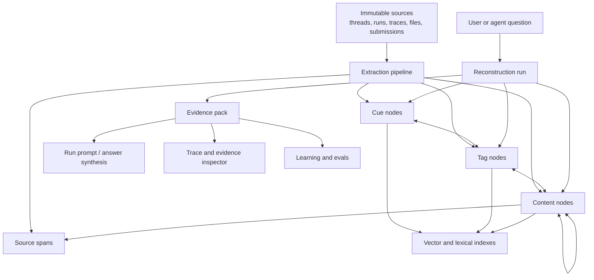

# Reconstructive Memory Rewrite

Status: proposal
Date: 2026-06-15
Source paper: [Memory is Reconstructed, Not Retrieved: Graph Memory for LLM Agents](https://arxiv.org/html/2606.06036v1)
Related implementation reference: [Ji-shuo/MRAgent](https://github.com/Ji-shuo/MRAgent)

## Short Version

If we take the paper seriously and do not care about legacy compatibility, Illo should stop treating memory as "ranked text snippets fetched before reasoning." The memory system should become a reconstructive evidence engine.

The current Illo system has many valuable pieces: scoped memory, pgvector, graph edges, truth/freshness, source provenance, DAG summaries, retrieval feedback, run evidence, and team visibility. But the center of gravity is still passive:

1. Build a query embedding.
2. Fetch top candidates.
3. Expand one graph hop or merge pools.
4. Rank/suppress with the attention controller.
5. Put selected memory text into context.

MRAgent's useful claim is different: memory access should be an active, stateful reasoning process. The agent should use partial evidence to decide what cue, tag, time window, entity, topic, or source span to inspect next. Retrieval should produce a traceable evidence path, not only a list of chunks.

So the no-legacy recommendation is:

- Delete the current flat memory/retrieval abstraction as the primary API.
- Replace it with a Cue-Tag-Content graph over immutable source material.
- Make "reconstruction runs" first-class runtime objects.
- Make the LLM choose bounded graph actions during recall.
- Return evidence packs and trajectories to runs, UI, evals, and learning.
- Keep Illo's governance strengths, but move them into the new graph and reconstruction runtime.

## What The Paper Changes

The paper's important contribution is not "use a graph." Illo already has graph edges. The important contribution is active reconstruction:

- The memory store is structured so cheap nodes can guide access to expensive content.
- Associative tags act as semantic bridges between user cues and memory contents.
- The model iteratively decides where to search next based on evidence found so far.
- The retrieval process has a stop condition and a path, not just a top-k result.
- Long-horizon questions benefit from depth. Increasing parallel top-k is not equivalent to following evidence over multiple turns.

That maps directly onto Illo's hardest memory failures:

- "What did we decide after that earlier discussion?"
- "Why does this keep happening?"
- "Which prior thread had the fix for this?"
- "What changed between the first plan and the final implementation?"
- "What does the team know about this project that is not in the current thread?"
- "Which memory is stale or contradicted, and what source proves it?"

These are reconstruction problems, not retrieval problems.

## Current Illo Memory Shape

The current system is roughly:

- `brain/platform/db/models/memory.py`
  - `Memory` is the primary unit.
  - `Edge` stores typed memory-to-memory relationships.
  - memory rows carry content, type, tier, salience, embeddings, tags, source metadata, truth metadata, visibility, user, and org.
- `brain/platform/db/models/memory_dag.py`
  - `MemorySummary` and `SummaryLineage` build a summary DAG over memories.
- `brain/platform/db/repositories/memories.py`
  - Owns inserts, vector recall, graph-augmented recall, visibility checks, edge activation, and many read paths.
- `brain/systems/memory/harvest.py`
  - Extracts durable memory candidates from conversations.
- `brain/systems/memory/attention_controller.py`
  - Ranks candidate memories/summaries, logs decisions, marks lazy-load candidates, and records usefulness.
- `brain/systems/memory/retrieval_pools.py`
  - Runs exploit/explore/narrative retrieval pools.
- `brain/systems/cognition/graph.py`
  - Wraps graph-augmented recall and memory neighborhoods.
- `brain/systems/cognition/consolidate.py` and `brain/systems/cognition/dag_compaction.py`
  - Consolidate episodic memories into semantic/procedural summaries and compact memory DAGs.
- `brain/systems/memory/truth_maintenance.py`, `source_freshness.py`, `conflict_scout.py`, `conflict_resolver.py`
  - Maintain freshness, contradiction, review, and truth status.
- `brain/app/mcp/server.py`
  - Exposes `brain_recall` as graph-augmented memory search and `brain_encode` as memory write.
- `brain/systems/cognition/frame.py`
  - Builds run context and preloads memory into the frame.
- `brain/systems/learning/context_evals.py`
  - Evaluates selected memory usage and stale/conflicted inclusion.

This is a strong second-generation memory system. It is not yet a reconstructive memory system.

## What Should Be Gone

This section assumes we do not care about legacy tables, compatibility wrappers, or preserving existing memory APIs.

### Delete The Flat Memory Row As The Primary Abstraction

`Memory` should not be the central thing everything points at. It mixes too many roles:

- raw event fragment
- extracted fact
- semantic claim
- preference
- procedure
- summary
- policy
- retrieval chunk
- display item
- truth-bearing assertion
- source-backed evidence

Those need to become separate node and evidence types. One row cannot keep serving as both source material and derived belief.

Keep the idea of scoped, durable memory. Remove the assumption that a memory is a single text blob with a vector and tags.

### Delete `brain_recall` As Top-k Search

`brain_recall(query, limit)` should not be the main agent-facing memory tool.

It encourages the wrong behavior:

- one query;
- fixed budget;
- one candidate list;
- no explicit search state;
- no iterative cue discovery;
- no source-path explanation beyond optional graph context.

Replace it with a reconstructive recall tool that can run to completion, plus lower-level graph operators for agents that need controlled exploration.

### Delete Retrieval Pools As A Primary Strategy

`retrieval_pools.py` is useful as a transitional experiment, but exploit/explore/narrative pools are still passive. They pick a more diverse candidate list before reasoning starts. They do not make retrieval depend on evidence found during reasoning.

In the new design, "explore" and "narrative" become actions the reconstruction policy can choose, not fixed slots allocated before the search.

### Delete One-hop Graph Expansion As "Graph Recall"

The current graph recall starts from vector seeds and expands one hop. That is a useful baseline, but it is not enough.

Graph recall should become bounded graph execution:

- start from cues;
- inspect tags;
- retrieve content behind selected tags;
- reverse-map content to new cues;
- traverse time, source, thread, actor, topic, and contradiction links;
- stop when the evidence state is sufficient.

### Delete Shadow-only Attention As The Core Recall Controller

The current `AttentionController` ranks candidates after another subsystem has already chosen them. That should be replaced by a policy controller that owns the active search loop.

The new controller should still log decisions, budgets, suppression, lazy loading, and usefulness. But it should log actions and state transitions, not just selected/suppressed candidate IDs.

### Delete Summary DAG As A Separate Memory Class

`MemorySummary` is useful, but it should not sit beside memory as a separate retrieval world. Summaries are content nodes with source lineage, depth, topic coverage, and validity metadata.

The graph should have one node model that can represent:

- raw source spans;
- episode content;
- semantic claims;
- procedures;
- policies;
- summaries;
- topics;
- thread states;
- artifact descriptions.

### Delete Ad Hoc Tags

`tags` and `topic_tags` should not be untyped string arrays on memory rows.

In the new system, tags are first-class graph nodes or edges:

- normalized;
- scoped;
- typed;
- source-backed;
- weighted;
- versioned;
- connected to cues and content.

Display labels can still exist, but retrieval tags must have semantics.

### Delete Memory Context As Plain Text Lines

Run context should not receive:

```text
Memory:
- some snippet
- another snippet
```

It should receive an evidence pack:

- answer-relevant facts;
- source spans;
- reconstruction path;
- unresolved conflicts;
- freshness status;
- confidence;
- omitted-but-near evidence;
- follow-up search handles.

The agent should know why evidence is present and what uncertainty remains.

### Delete "Write Memory" As A Generic Tool

`brain_encode(content, type, salience)` is too unconstrained for a reconstructive system.

Replace it with source ingestion and derived-memory proposal:

- ingest raw source material;
- extract candidate content, cues, tags, and evidence spans;
- validate and link;
- commit derived nodes with provenance;
- let humans or policy confirm high-impact claims.

Agents should rarely create a final belief directly.

## What Should Stay, But Be Rebuilt

### Visibility And Tenant Boundaries

Illo's visibility model is a real advantage over benchmark memory systems. Keep it, but move it down into every node, edge, source span, reconstruction run, and index row.

No graph action should be able to traverse into content the caller cannot see.

### Truth, Freshness, And Conflict

Keep the intent of `truth_maintenance.py`, `source_freshness.py`, `conflict_scout.py`, and `conflict_resolver.py`, but integrate them into reconstruction.

Truth should not be a post-processing decoration on retrieved memories. It should influence traversal:

- stale nodes can be inspected but should not silently support conclusions;
- contradictions should become retrieval attractors when the query asks "what changed" or "which is true";
- source freshness should be checked before final answer synthesis;
- unresolved conflicts should appear in the evidence pack.

### Learning And Retrieval Feedback

Keep feedback, but change the unit of feedback.

Old feedback:

- query -> candidate list -> selected/suppressed -> maybe useful.

New feedback:

- question -> reconstruction run -> action sequence -> evidence nodes -> final answer -> verifier/user feedback.

The system should learn which actions and graph paths produce useful evidence.

### DAG Compaction

Keep compaction, but rebuild it as graph-aware summarization.

Current compaction groups memories in chunks and summarizes them by depth. The new compaction should preserve:

- cue coverage;
- tag coverage;
- source lineage;
- temporal boundaries;
- conflicts;
- open questions;
- retrieval affordances.

A summary that cannot be traversed is not enough.

### Inbound Context

Illo's `illo_submit` and Universal Thread direction fit this rewrite well. Inbound context should become the main source layer for reconstructive memory.

Every external-agent submission should be stored as immutable source material first. Derived memories are secondary.

## New Architecture

The new memory system should be built around five layers:

1. Source layer
2. Graph layer
3. Index layer
4. Reconstruction layer
5. Evidence layer



## New Data Model

This is a clean replacement schema, not an additive migration.

### `memory_sources`

Immutable source material.

Fields:

- `id`
- `org_id`
- `user_id`
- `visibility`
- `source_kind`: `thread_message`, `agent_run`, `tool_trace`, `file`, `inbound_submission`, `chat`, `cycle`, `domain_record`, `manual_note`
- `source_ref`
- `source_url`
- `content_digest`
- `raw_content`
- `structured_payload`
- `created_at`
- `observed_at`
- `valid_from`
- `valid_until`
- `authority_principal`
- `sensitivity`
- `retention_policy`

Rule: derived memory cannot exist without at least one source or an explicit manual assertion record.

### `memory_spans`

Addressable pieces of a source.

Fields:

- `id`
- `source_id`
- `span_kind`: `text`, `json_path`, `diff_hunk`, `tool_call`, `artifact`, `image_region`, `table_cell`
- `locator`
- `text`
- `token_count`
- `content_digest`
- `created_at`

This lets evidence cite exact spans rather than whole memories.

### `memory_nodes`

The unified node table.

Fields:

- `id`
- `node_kind`: `cue`, `tag`, `content`, `topic`, `summary`, `procedure`, `policy`, `question`, `artifact`, `actor`, `time_window`
- `content_kind`: nullable, for content-like nodes: `episode`, `semantic_claim`, `decision`, `preference`, `lesson`, `procedure_step`, `state_snapshot`
- `canonical_label`
- `text`
- `normalized_key`
- `scope_key`
- `org_id`
- `user_id`
- `visibility`
- `sensitivity`
- `confidence`
- `truth_status`
- `freshness_status`
- `valid_from`
- `valid_until`
- `created_at`
- `updated_at`
- `archived_at`

There is no separate `MemorySummary` table. A summary is a node with edges to source nodes and spans.

### `memory_node_embeddings`

Separate embeddings from node identity.

Fields:

- `id`
- `node_id`
- `embedding_kind`: `semantic`, `retrieval_query`, `cue`, `tag`, `summary`, `source_span`
- `model`
- `dimension`
- `embedding`
- `content_digest`
- `created_at`

This makes model upgrades and multi-vector retrieval less painful.

### `memory_edges`

Typed graph relationships.

Fields:

- `id`
- `source_node_id`
- `target_node_id`
- `edge_kind`: `cue_to_tag`, `tag_to_content`, `content_to_cue`, `supports`, `contradicts`, `supersedes`, `derived_from`, `summarizes`, `specializes`, `same_as`, `near_duplicate`, `caused_by`, `before`, `after`, `mentions`, `owned_by`, `belongs_to_thread`, `about_project`, `uses_tool`
- `weight`
- `confidence`
- `directionality`
- `org_id`
- `visibility`
- `evidence_span_ids`
- `created_by`: `extractor`, `human`, `reconstruction`, `compaction`, `policy`
- `created_at`
- `last_activated_at`
- `activation_count`

Edges must be source-backed unless they are deterministic system edges.

### `memory_assertions`

Truth-bearing claims separated from display text.

Fields:

- `id`
- `node_id`
- `claim_text`
- `subject_node_id`
- `predicate`
- `object_node_id`
- `object_text`
- `polarity`
- `confidence`
- `truth_status`
- `review_status`
- `source_span_ids`
- `valid_from`
- `valid_until`
- `created_at`
- `reviewed_at`

This is where contradiction and supersession should operate.

### `reconstruction_runs`

One active memory reasoning episode.

Fields:

- `id`
- `run_id`
- `thread_id`
- `query_text`
- `query_kind`: `fact_lookup`, `multi_hop`, `temporal`, `preference`, `decision_history`, `root_cause`, `procedure`, `conflict_resolution`, `project_context`
- `org_id`
- `user_id`
- `visibility_context`
- `budget_tokens`
- `budget_steps`
- `policy_version`
- `model`
- `status`
- `final_confidence`
- `created_at`
- `completed_at`

### `reconstruction_steps`

The action trace.

Fields:

- `id`
- `reconstruction_run_id`
- `step_index`
- `state_summary`
- `action_kind`: `seed_cues`, `expand_tags`, `retrieve_content`, `inspect_source`, `follow_edge`, `query_time`, `query_actor`, `query_topic`, `check_conflict`, `summarize_evidence`, `stop`
- `action_input`
- `action_output`
- `selected_node_ids`
- `rejected_node_ids`
- `reason`
- `cost_tokens`
- `latency_ms`
- `created_at`

### `reconstruction_evidence`

The final support set.

Fields:

- `id`
- `reconstruction_run_id`
- `node_id`
- `assertion_id`
- `source_span_id`
- `role`: `supports_answer`, `contradicts_answer`, `background`, `temporal_anchor`, `identity_anchor`, `omitted_near_miss`
- `confidence`
- `rank`
- `created_at`

### `reconstruction_feedback`

Learning signals.

Fields:

- `id`
- `reconstruction_run_id`
- `signal_kind`: `user_positive`, `user_negative`, `verifier_pass`, `verifier_fail`, `cited_in_output`, `tool_argument_used`, `answer_correct`, `answer_incomplete`, `privacy_violation`, `stale_included`, `critical_missed`
- `target_step_id`
- `target_node_id`
- `target_edge_id`
- `details`
- `created_at`

## New Extraction Pipeline

The extraction pipeline should replace `harvest.py`, `encoder.py`, direct `brain_encode`, and much of manual memory insertion.

Pipeline:

1. Ingest source.
2. Segment into spans.
3. Extract candidate content nodes.
4. Extract cue nodes.
5. Extract tag nodes.
6. Link cue -> tag -> content.
7. Extract assertions from content.
8. Link assertions to source spans.
9. Detect duplicates and same-as nodes.
10. Detect temporal anchors.
11. Detect contradictions and supersession candidates.
12. Embed cues, tags, content, and spans.
13. Commit as a single source-backed graph transaction.

The extraction contract should require structured JSON like:

```json
{
  "content_nodes": [],
  "cue_nodes": [],
  "tag_nodes": [],
  "edges": [],
  "assertions": [],
  "source_spans": [],
  "uncertainties": []
}
```

Every derived object must include:

- source span locator;
- confidence;
- visibility and sensitivity;
- reason it should be durable;
- expected retrieval use.

If the extractor cannot cite evidence, it should emit an uncertainty, not a memory.

## New Reconstruction Runtime

The reconstruction runtime is the core of the rewrite.

### Input

- user or agent query;
- current thread/run context;
- viewer permissions;
- budget profile;
- freshness requirements;
- answer mode.

### State

The reconstruction state should include:

- original query;
- inferred query kind;
- known cues;
- unresolved cues;
- selected tags;
- retrieved content nodes;
- source spans inspected;
- candidate assertions;
- conflicts;
- temporal constraints;
- confidence;
- stop condition;
- remaining budget.

### Actions

Minimum action vocabulary:

- `seed_cues(query)`
- `expand_tags(cue_ids)`
- `retrieve_content(cue_ids, tag_ids)`
- `reverse_cues(content_ids)`
- `follow_edges(node_ids, edge_kinds)`
- `inspect_source(span_or_source_ids)`
- `query_time(time_window, cue_ids)`
- `query_actor(actor_ids, cue_ids)`
- `query_topic(topic_ids)`
- `check_conflicts(assertion_ids_or_node_ids)`
- `summarize_evidence(evidence_ids)`
- `stop(reason)`

This vocabulary should exist as internal Python operations and, selectively, as agent tools.

### Policy

The policy can begin as an LLM planner with hard deterministic guards:

- max steps;
- max content tokens;
- max source spans;
- no cross-visibility traversal;
- no stale support without freshness annotation;
- no final answer without at least one supporting evidence span for factual claims;
- no silent contradiction suppression.

Later, Illo can learn action priors from reconstruction feedback.

### Output

The output is not a list of memories. It is an evidence pack:

```json
{
  "answer_context": [],
  "supporting_evidence": [],
  "contradicting_evidence": [],
  "source_spans": [],
  "trajectory": [],
  "confidence": 0.0,
  "unresolved_questions": [],
  "follow_up_handles": []
}
```

## New Tool Surface

### Replace `brain_recall`

New high-level tool:

```text
memory_reconstruct(query, mode?, budget?, require_sources?, freshness?)
```

Returns:

- answer-ready evidence pack;
- reconstruction trace;
- source citations;
- unresolved conflicts;
- suggested follow-up queries.

### Add Low-level Graph Tools

Expose only when the agent is allowed to drive memory search manually:

- `memory_seed_cues`
- `memory_expand_tags`
- `memory_retrieve_content`
- `memory_follow_edges`
- `memory_inspect_source`
- `memory_check_conflicts`
- `memory_finalize_evidence`

These should be scoped, logged, and budgeted.

### Replace `brain_encode`

New write tools:

- `memory_ingest_source`
- `memory_propose_nodes`
- `memory_commit_extraction`
- `memory_review_assertion`
- `memory_supersede_assertion`

Most agents should call `memory_ingest_source`, not manually write claims.

## New Module Layout

Suggested clean package:

```text
brain/systems/reconstructive_memory/
  __init__.py
  contracts.py
  source_ingest.py
  span_segmenter.py
  extraction.py
  normalization.py
  graph_store.py
  indexes.py
  reconstruction_state.py
  actions.py
  policy.py
  controller.py
  evidence_pack.py
  compaction.py
  truth.py
  freshness.py
  feedback.py
  evals.py
  tools.py
```

Database repositories should move from "memory repository does everything" to narrower stores:

```text
brain/platform/db/repositories/
  memory_sources.py
  memory_nodes.py
  memory_edges.py
  memory_assertions.py
  memory_reconstruction.py
```

The MCP and agent tool layer should call service APIs, not construct recall logic directly in `brain/app/mcp/server.py`.

## Current File Impact

If this were a true rewrite, these are the affected areas.

### Replace

- `brain/platform/db/models/memory.py`
  - Replace `Memory`, `Edge`, and tag storage with the node/edge/source/assertion schema.
- `brain/platform/db/models/memory_dag.py`
  - Delete as a separate model family. Summaries become graph nodes.
- `brain/platform/db/repositories/memories.py`
  - Split into source/node/edge/assertion/reconstruction repositories.
- `brain/systems/memory/harvest.py`
  - Replace with source-backed extraction.
- `brain/systems/memory/attention_controller.py`
  - Replace candidate ranker with reconstruction controller.
- `brain/systems/memory/retrieval.py`
  - Replace query preprocessing with query-kind and cue-seeding.
- `brain/systems/memory/retrieval_pools.py`
  - Delete. Fold exploration into active policy actions.
- `brain/systems/cognition/graph.py`
  - Replace graph recall wrapper with graph action service.
- `brain/systems/cognition/frame.py`
  - Replace memory preloading with evidence-pack construction.
- `brain/app/mcp/server.py`
  - Replace `brain_recall` and `brain_encode` implementation with thin wrappers over reconstructive memory tools.

### Rebuild Around The New Model

- `brain/systems/cognition/consolidate.py`
- `brain/systems/cognition/dag_compaction.py`
- `brain/systems/memory/truth_maintenance.py`
- `brain/systems/memory/source_freshness.py`
- `brain/systems/memory/conflict_scout.py`
- `brain/systems/memory/conflict_resolver.py`
- `brain/systems/memory/retrieval_feedback.py`
- `brain/systems/learning/context_signals.py`
- `brain/systems/learning/context_evals.py`
- `brain/systems/runs/evidence.py`

### Update Product Surfaces

- Memory admin pages should show source-backed graph nodes, not a flat memory list.
- Run traces should show reconstruction paths.
- Thread context panels should show evidence packs and source spans.
- Debug views should show why a memory path was taken or pruned.
- Conflict review should operate on assertions and evidence, not opaque memory rows.

## Agent Runtime Changes

### Frame Assembly

Old:

- preload selected memories into prompt context.

New:

- classify task memory need;
- run cheap reconstruction only when useful;
- attach evidence pack to the run;
- expose follow-up memory actions as tools;
- force source-backed claims for factual or team-memory answers.

### Direct Agent Loop

The agent should see memory as an active workspace:

- "I found these cues."
- "I followed this tag."
- "This source span supports the claim."
- "This older claim is contradicted by this newer source."
- "I stopped because evidence coverage is sufficient."

This makes memory behavior inspectable and teachable.

### External Agent Ingress

`illo_submit` should feed the source layer. If Codex, Claude Code, Hermes, OpenClaw, Slack, Jira, or a webhook sends context, Illo should:

1. store the envelope as source;
2. segment it into spans;
3. extract reconstructive graph nodes;
4. attach derived summaries to the Thread only as views;
5. keep the raw source inspectable.

## UI Changes

The UI should stop showing memory as only a searchable list of snippets.

New UI surfaces:

- Source ledger: immutable raw material and source spans.
- Memory graph explorer: cues, tags, content, assertions, and edges.
- Reconstruction trace: step-by-step memory search path for a run.
- Evidence pack viewer: answer support, contradictions, freshness, and confidence.
- Assertion review: confirm, supersede, quarantine, or merge claims.
- Extraction review: see what source produced which nodes.

Important product behavior:

- Users should be able to ask "why did Illo remember this?"
- Users should be able to delete or quarantine source material and understand derived impact.
- Users should be able to inspect exact source evidence for team-facing claims.

## Evaluation Plan

Do not ship this by vibes. Build evals before replacing the current system.

### Baselines

Compare:

- current vector recall;
- current graph-augmented recall;
- current attention controller;
- current retrieval pools;
- reconstructive recall without tags;
- reconstructive recall without semantic content nodes;
- reconstructive recall without active multi-step policy;
- full reconstructive recall.

### External Benchmarks

Use:

- LoCoMo-style multi-session QA;
- LongMemEval-style long-term memory QA;
- synthetic binary-tree needle tasks;
- temporal reasoning tasks;
- preference/history tasks.

### Illo-native Benchmarks

Create eval cases from:

- Cortex threads;
- inbound submissions;
- agent run traces;
- project workspaces;
- decisions and reversals;
- stale repository memory;
- teammate-visible vs private memory boundaries.

### Metrics

Track:

- answer correctness;
- evidence recall;
- evidence precision;
- critical memory miss rate;
- stale/conflicted inclusion rate;
- source citation coverage;
- privacy boundary violations;
- token cost;
- latency;
- reconstruction step count;
- useless action rate;
- user correction rate.

The paper's reported gains are promising, but Illo needs product-native evals because team memory has permissions, source freshness, and operational consequences that benchmark QA does not fully cover.

## Design Rules For The Rewrite

1. Sources are immutable. Derived memory can be changed, but source material is append-only except for deletion/retention policy.
2. No derived claim without evidence. Manual assertions are evidence too, but they must be explicit.
3. Retrieval returns paths, not just nodes.
4. Every final answer should know which evidence supports it.
5. Contradictions are first-class retrieval targets.
6. Staleness is visible during traversal, not after answer generation.
7. Summary nodes must preserve traversal affordances.
8. Tags are semantic graph objects, not string labels.
9. Memory tools must be permission-scoped at every action.
10. The system should learn from trajectories, not only final retrieved items.

## What Not To Copy From MRAgent

Do not copy the paper as-is.

MRAgent is a research memory engine. Illo is a team workspace and agent runtime. Illo needs additional constraints:

- multi-tenant permissions;
- source deletion and retention;
- human review;
- agent run auditability;
- external-agent ingress;
- stale repository facts;
- private/team/org visibility;
- UI inspectability;
- operational cost controls.

The useful import is active reconstruction over an associative graph, not the exact benchmark implementation.

## Migration If We Truly Ignore Legacy

If legacy does not matter, do not migrate old memory rows in place.

Recommended path:

1. Freeze old memory writes.
2. Export every old memory row as a `memory_sources` record with provenance saying `legacy_memory_import`.
3. Export old edges as source-backed candidate edges with low confidence unless they have evidence.
4. Re-run the extraction pipeline over legacy rows.
5. Rebuild cues, tags, content nodes, assertions, embeddings, and summaries from scratch.
6. Drop old tables after validation.

Old memory content should be treated as source material, not as already-correct graph truth.

## Definition Of Done

This rewrite is successful when:

- `brain_recall` no longer exists as the main abstraction.
- Memory writes happen through source-backed extraction.
- Agent runs receive evidence packs instead of memory snippet lists.
- Every recall produces a reconstruction trace.
- The UI can show why a claim was remembered and where it came from.
- Evals show better multi-hop, temporal, and long-horizon recall than current graph recall.
- Privacy and visibility tests prove graph traversal cannot leak private nodes.
- Stale/conflicted memory is lower than the current attention-controller baseline.
- Token cost remains bounded by policy and measured per reconstruction run.

## Core Bet

Illo should become better than MRAgent by combining MRAgent's reconstructive memory access with Illo's strengths:

- team context;
- source provenance;
- permissions;
- agent run traces;
- inbound coordination;
- truth maintenance;
- human review;
- operational dashboards.

The paper points at the missing center: memory is an active reasoning process. Illo already has enough surrounding infrastructure to make that process useful in a real collaborative workspace.
